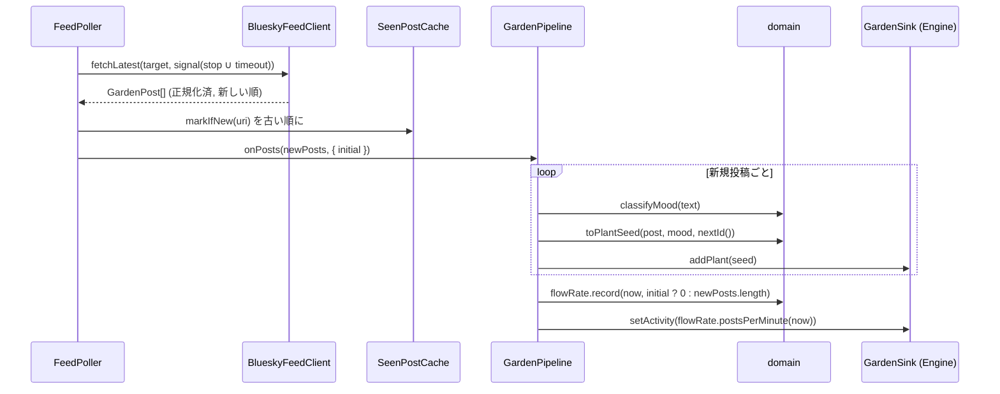
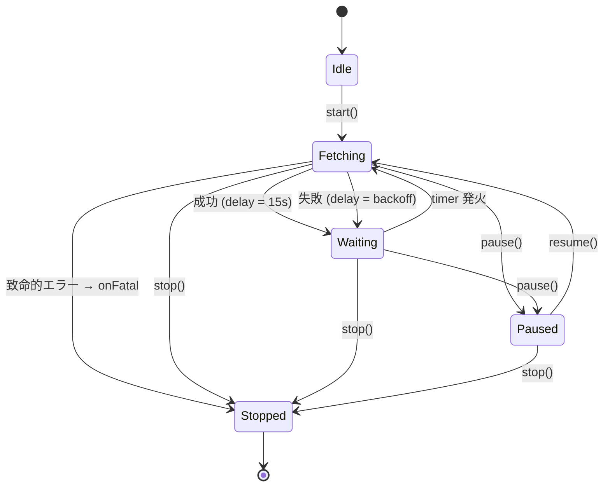
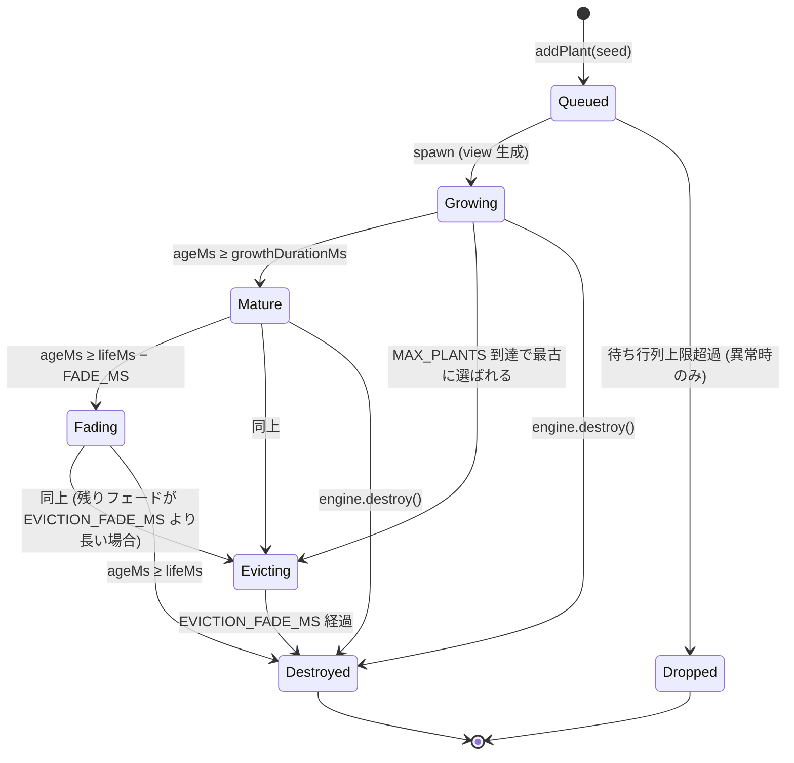

# BlueGarden 詳細設計書 (DESIGN.md)

| 項目 | 内容 |
|---|---|
| 対象 | BlueGarden MVP (SPEC §34–35, §43) |
| 作成日 | 2026-10-04 |
| 状態 | v4.6 / アプリ 1.0.0 (MVP + Phase 2–4 実装・実機確認済み) |
| v4.7 | ユーザー承認により SPEC を修正: §3/§9.2/§33/§37 秘密情報の保存先を OS の資格情報ストアに (D-6/D-19)、§8.4 FeedTarget に `global` を追加 (D-18)、§37 Screensaver Mode をアプリ内モードと明記 (D-27)、§43-4 「1 投稿 = 1 植物」の範囲を明確化 (D-10/D-25)。D-2 (rate limit 5 分) は未実装のため反映しない |
| 優先順位 | `docs/SPEC.md` > `AGENTS.md` > `docs/DESIGN.md` > 実装 |

本書は `docs/SPEC.md`(以下 SPEC)の要求を具体的なソフトウェア構造へ落とし込むものであり、要求そのものは変更しない。SPEC と矛盾する記述を見つけた場合は SPEC が優先される。SPEC で数値が未指定の箇所に本書が値を与える場合は「設計値」と明記し §30 で一覧化する。SPEC の解釈・補足提案は §31 に集約する。

---

## 0. 前提: 現状と検証済み技術情報

### 0.1 リポジトリ現状 (2026-10-04)

```text
BlueGarden/
├─ AGENTS.md
├─ docs/SPEC.md          ← SPEC 本体
└─ .claude/agents/       ← プロジェクト専用サブエージェント 5 種
```

`package.json` / `src/` / `src-tauri/` は存在しない。コードはゼロから作成する。アプリケーションのルートはリポジトリルート (`BlueGarden/`) とし、SPEC §7 の `bluegarden/` はこのルートに相当するものとして扱う (サブディレクトリは作らない)。git リポジトリではない。

### 0.2 設計時点で確認した公式情報

| 対象 | 確認結果 | 設計への影響 |
|---|---|---|
| Tauri 2 | `@tauri-apps/cli` 2.12.x, `create-tauri-app` 4.7.x | 標準テンプレート (React + TS + Vite) を使う |
| React | 19.3.x。StrictMode は dev で effect を setup→cleanup→setup。form action 対応 | Engine の async init 競合対策 (§13.3)、password を state に置かない (§7.3) |
| TypeScript | latest は **7.0.x (Go 実装)**。`typescript-eslint@8.71` の peer は `<6.1.0` | **TS 6.0.x に固定** (ADR-08) |
| Vite / Vitest | Vite 8.x / Vitest 5.x (Node `^22.12 \|\| >=24`) | Node `>=22.13` を `engines` に記載 |
| ESLint | 10.x + typescript-eslint 8.x + eslint-plugin-react-hooks 7.x | flat config |
| PixiJS | **8.22.0** (2026-10-01)。v9 なし。minor で挙動変更あり。`init()` は async。v8 はシェーダ同期コードに `new Function` を使う | `~8.22.0` 固定、`pixi.js/unsafe-eval` を import (§22.3) |
| `@bsky/sdk` | 1.1.5。lexicon 定義・型のみ、通信/認証コードなし | `@atproto/lex` の `Client` と組み合わせる |
| `@atproto/lex` | 0.3.x。`new Client(session)`、`client.call(app.bsky.feed.getTimeline, params)` | API 呼び出しの基盤 |
| `@atproto/lex-password-session` | 0.2.x。`PasswordSession.login({ service, identifier, password, fetch?, onUpdated?, onUpdateFailure?, onDeleted?, onDeleteFailure? })`。401 / `ExpiredToken` で自動 refresh。`logout()` は deleteSession。ログイン後は didDoc の PDS へ送信 | App Password 認証 (ADR-04) |
| `@atproto/api` | 0.23.x。README が新規は lex 推奨、App Password ログインは非推奨扱い | **採用しない** |
| `@bsky/jetstream` | 1.0.0。`for await (evt of js.live({...}))` | Phase 3。MVP では導入しない |
| Rate limit | createSession: 30 回 / 5 分、300 回 / 日 (アカウント単位) | ログイン自動再試行をしない (§7.4) |
| Tauri Stronghold | 公式プラグインは存在するが、メンテナが「v3 で削除予定」と表明 | 将来の保存先は OS keyring を第一候補 (§22.4) |

### 0.3 未検証事項 (実装 Step 1 のスパイクで確認する)

スパイクは**使い捨ての dev 専用スクリプト**として、テスト用アカウントで実行し、確認後に削除する。ログイン試行は rate limit を考慮し合計 5 回以内とする。結果は本節に追記する。

| ID | 内容 | 失敗時の代替 |
|---|---|---|
| V-1 | Tauri webview (`http://tauri.localhost` / `tauri://localhost`) から bsky.social / PDS への `fetch` が CORS・本番 CSP 下で通るか | `@tauri-apps/plugin-http` の `fetch` を `PasswordSession.login({ fetch })` に注入 |
| V-2 | `@atproto/lex` / `@atproto/lex-password-session` が Vite でブラウザ向けにバンドルできるか | `@atproto/api` を一時フォールバックとし ADR-04 を更新 |
| V-3 | 誤った App Password / 存在しない handle / login 時 429 の実際のエラー名・HTTP ステータス | §20 を HTTP ステータス主体で判定 |
| V-4 | `getTimeline` の `since` / `startCursor` の挙動 | 使わず「先頭ページ取得 + URI 重複排除」(MVP 既定) |
| V-5 | rate limit ヘッダ名と形式 (`ratelimit-reset` は epoch 秒の想定) | ヘッダがなければ通常バックオフのみ |
| V-6 | `PasswordSession` が password をインスタンスに保持しないか。SDK 例外が request 情報 (password を含む body) を保持・露出しないか | 保持する場合は issue 化し、例外を境界で捨てる設計 (§21) で露出を防ぐ |
| V-7 | `client.call(method, params, { signal })` で AbortSignal を渡せるか | 渡せない場合は timeout / stop 後の結果を Poller 側で破棄 |
| V-8 | `@bsky/sdk/lexicons` サブパス import が型・実行時とも解決できるか | パッケージルートから import |
| V-9 | `client.call` がレスポンスを lexicon 検証するか (1 件不正でページ全体が `XrpcInvalidResponseError` になるか) | 検証される場合は検証なしモード / 生 JSON 取得の方法を探す。なければページ単位の失敗として扱う |
| V-10 | `pixi.js/unsafe-eval` import で `script-src 'self'` のまま動作するか。`Graphics.destroy()` の所有 context 破棄条件 | CSP に `'unsafe-eval'` を加えることは**しない**。別手段を検討 |
| V-11 | PixiJS 8.22 が WebGL context lost → restored を自動復旧するか | 復旧しない場合は Engine 再生成 (§13.8) |
| V-12 | `PasswordSession.logout()` が `onDeleted` を発火するか | 発火の有無に関わらず `loggingOut` フラグで無視する (§7.2) |

### 0.4 検証結果 (2026-10-04, MVP 実装時)

Windows 11 / WebView2 154 / Tauri debug ビルド (本番 CSP 適用, origin `http://tauri.localhost`) と、インストール済み SDK の型定義・実装で確認した。

| ID | 結果 |
|---|---|
| V-1 | ✅ `bsky.social` への GET・`authorization` 付き GET・JSON POST (`createSession`) が CORS を通過。CSP 許可外 (`https://example.com`) は遮断を確認。PDS (`*.bsky.network`) への実通信は正規ログインが必要なため未確認 |
| V-2 | ✅ `npm run build` / `tauri build --debug` で問題なくバンドル・起動 |
| V-3 | ✅ 存在しない handle + App Password 形式の誤パスワード → `401 AuthenticationRequired` ("Invalid identifier or password")。UI に「ハンドルまたは App Password が正しくありません」を表示 |
| V-4 | 未使用 (MVP 既定どおり先頭ページ + 重複排除) |
| V-5 | ✅ `ratelimit-reset` は epoch 秒で、WebView から読み取り可能 |
| V-6 | ✅ `PasswordSession.login` は password を分割代入で受け取り `createSession` に渡すのみで、インスタンスに保持しない |
| V-7 | ✅ `client.xrpcSafe(method, { params, signal, validateResponse })` で AbortSignal を渡せる |
| V-8 | ✅ `@bsky/sdk/lexicons` は package exports に存在し型・実行時とも解決 |
| V-9 | ⚠ `validateResponse` は既定 `true` (1 件の不正でページ全体が失敗)。`validateResponse: false` を指定し `normalizeFeed` で item 単位に検証する (§8.2 の呼び出しを `client.call` から `client.xrpcSafe` に変更) |
| V-10 | ✅ `pixi.js/unsafe-eval` import により、`script-src 'self'` のまま描画できることを Tauri 本番 CSP 下で確認 |
| V-11 | 未確認 (GPU リセットの再現が困難)。§13.8 の「復旧しない場合」の経路 (Engine 再生成) を常に採用 |
| V-12 | ✅ `logout()` は `onDeleted` を発火する (`loggingOut` フラグで抑止済み) |

追加で判明した事項:
- 無効なアクセストークンは `400 InvalidToken` を返す。
- SDK はアクセストークン失効時の refresh が**一時的に**失敗すると `onUpdateFailure` を呼び、元の 401 / `ExpiredToken` 応答をそのまま返す (セッションは生存)。このためフィード取得での認証エラーは、セッションが `destroyed` の場合のみ `sessionExpired` とし、それ以外は再試行可能な `serverError` としてバックオフする (`classifyFeedFailure`)。

---

## 1. Design Goals (設計目標)

| # | 目標 | 具体策 | 主な関連節 |
|---|---|---|---|
| G1 | 長時間安定動作 | API 失敗・描画例外が描画ループを止めない。全非同期処理に停止経路とタイムアウト | §9, §13.6, §20 |
| G2 | メモリ使用量の上限制御 | 植物・粒子・既読 URI・流速サンプル・スポーン待ち行列すべてに上限 | §15 |
| G3 | API と描画の分離 | 描画層は `PlantSeed` と数値のみ受け取る。SDK 型は services 層の外に出さない | §2, §3 |
| G4 | TypeScript による型安全性 | strict 系フラグ。外部データは `unknown` から narrowing | §8.3, §22 |
| G5 | 投稿の不要な保持を避ける | 本文は mood 判定後に破棄。描画層・React state・ログに本文なし | §23 |
| G6 | MVP 優先 | Timeline + Light Particle のみ。Phase 2–4 は拡張点の確保に留める | §26, §27 |
| G7 | 将来の Jetstream / 3D 化への拡張性 | Data Source の出力契約と `PlantSeed` 境界・Engine API を固定 | §27 |

**非目標 (MVP)**: 投稿本文の表示、投稿履歴、オフライン動作、複数アカウント、設定・認証情報の永続化、サードパーティ PDS 対応 (Q-1)。

---

## 2. System Architecture

### 2.1 全体構成

```mermaid
flowchart TD
    subgraph External
        BSKY[(Bluesky PDS / AppView)]
    end

    subgraph Tauri["Tauri 2 (Rust host + OS WebView)"]
        subgraph WebView["WebView: React + TypeScript"]
            subgraph UI["UI Layer (components)"]
                LOGIN[LoginPanel]
                MENU[GardenMenu]
                ERR[ErrorBanner]
                CANVAS[TerrariumCanvas]
            end
            subgraph APP["Application Layer (app/, hooks/)"]
                HOOKS[useBlueskySession / useTerrarium / useGardenFeed]
                PIPE[GardenPipeline]
            end
            subgraph SVC["Bluesky Service Layer"]
                SESSION[blueskySession]
                CLIENT[BlueskyFeedClient]
                NORM[normalizeFeed]
                POLL[FeedPoller]
                SEEN[SeenPostCache]
            end
            subgraph DOMAIN["Domain Layer"]
                MODELS[models]
                MOOD[classifyMood]
                MAP[toPlantSeed / engagement / palette]
                FLOW[FlowRateMeter]
            end
            subgraph RENDER["Rendering Layer"]
                ENGINE[TerrariumEngine]
                PIXI[PixiJS]
            end
        end
        RUST[src-tauri: window / CSP / capabilities]
    end

    BSKY -->|XRPC JSON| CLIENT
    SESSION -->|Client| CLIENT
    CLIENT --> NORM
    NORM -->|GardenPost[]| POLL
    POLL --> SEEN
    POLL -->|新規 GardenPost[] のみ| PIPE
    PIPE --> MOOD
    PIPE --> MAP
    MAP -->|PlantSeed| ENGINE
    PIPE --> FLOW
    FLOW -->|postsPerMinute| ENGINE
    ENGINE --> PIXI
    HOOKS --> PIPE
    HOOKS --> ENGINE
    HOOKS --> SESSION
    LOGIN --> HOOKS
    MENU --> HOOKS
    CANVAS -.host div.-> HOOKS
    RUST -.hosts.-> WebView
```

SPEC §5 の基本パイプラインはそのまま維持する:

```text
Bluesky → Data Source (FeedPoller: 取得・正規化・重複排除) → GardenPost → Post Mapping → PlantSeed → TerrariumEngine → PixiJS
```

### 2.2 React / Tauri の位置付け

- **Tauri** はウィンドウ・WebView・CSP・capabilities を提供するホスト。MVP では Rust 側に独自コマンドを追加せず、IPC も使わない。Bluesky 通信は WebView 内の `fetch` で行う (V-1 失敗時のみ plugin-http)。
- **React** は「ログイン状態・エラー表示・キャンバスの寿命」だけを管理する。投稿・植物は React state に入らない。
- **GardenPipeline** (Application 層) は React に依存しない純 TypeScript のオーケストレータ。Data Source が出す新規 `GardenPost` を `PlantSeed` に変換し、`GardenSink` (Engine) へ渡す。React hook はその起動・停止のみを行う。

---

## 3. Layer Responsibilities

| Layer | Responsibilities | Dependencies | Must not depend on |
|---|---|---|---|
| **UI** (`src/components/`) | ログインフォーム、エラーバナー、メニュー (ログアウト)、キャンバス用 DOM 要素 | hooks (props 経由の値・コールバック) | services, domain の実装, PixiJS, SDK, Engine メソッドの直接呼び出し |
| **Application** (`src/app/`, `src/hooks/`) | セッション状態遷移、Engine の生成/破棄、Pipeline の起動/停止、エラーの表示用変換、`GardenSink` 契約 | services, domain, rendering の公開 API、React (hooks のみ) | SDK 型の直接利用、Pixi 内部 |
| **Bluesky Service** (`src/services/bluesky/`) | 認証、`getTimeline` 呼び出し、レスポンス正規化、ポーリング・タイムアウト・バックオフ、**既読 URI による重複排除**、エラー分類 | `@atproto/lex`, `@atproto/lex-password-session`, `@bsky/sdk`, domain の型, `config`, `infra/logger` | React, PixiJS, rendering, Tauri API (V-1 フォールバック時の fetch 注入を除く) |
| **Domain** (`src/domain/`) | `GardenPost`/`Mood`/`PlantSeed`/`FeedTarget` 定義、mood 判定、engagement・scale・成長時間、色選択、投稿流速計測 | `config` のみ | React, PixiJS, Tauri, SDK, services, ブラウザ API (時刻・ID は引数で受け取る) |
| **Rendering** (`src/rendering/`) | PixiJS 初期化、植物生成・成長・揺れ・フェード・破棄、Light Particle、リサイズ、context loss 検知、リソース解放 | `pixi.js`, domain の型 (`PlantSeed`, `Mood`), `config`, `infra/logger` | services, SDK, React, `GardenPost`, 投稿本文 |
| **Infrastructure** (`src/config/`, `src/infra/`, `src-tauri/`) | 定数、ロガー、Tauri 設定 (CSP / capabilities / window) | なし (最下層) | 上位層すべて |

依存方向 (矢印は import 方向):

```text
components ← (props) ← hooks → app → services → domain → config
                          └──→ rendering ──→ domain(types) → config
                       (全層) → infra/logger
dev/ (開発ビルドのみ) → app (GardenSink), domain
```

---

## 4. Directory Structure (MVP 完成時)

```text
BlueGarden/
├─ AGENTS.md / .claude/
├─ docs/                          SPEC.md, DESIGN.md
├─ .gitignore                      node_modules, dist, src-tauri/target, .env*
├─ index.html
├─ package.json                    engines.node ">=22.13"
├─ tsconfig.json                   project references (テンプレート準拠)
├─ tsconfig.app.json               src 用 (strict 系フラグ, noEmit)
├─ tsconfig.node.json              vite/vitest 設定ファイル用
├─ vite.config.ts
├─ vitest.config.ts                vite.config を merge。environment: "node"
├─ eslint.config.js
├─ src/
│  ├─ main.tsx                     React エントリ + unhandledrejection ハンドラ
│  ├─ App.tsx                      画面合成。hostRef を持ち hooks を呼ぶ
│  ├─ styles.css
│  ├─ components/                  UI 層 (表示のみ)
│  │  ├─ LoginPanel.tsx
│  │  ├─ ErrorBanner.tsx
│  │  ├─ GardenMenu.tsx            右上メニュー: ログアウト (+ "設定: Phase 2" 無効項目)
│  │  └─ TerrariumCanvas.tsx       ref を受け取る div のみ
│  ├─ hooks/
│  │  ├─ useBlueskySession.ts
│  │  ├─ useTerrarium.ts
│  │  └─ useGardenFeed.ts
│  ├─ app/
│  │  ├─ GardenPipeline.ts         GardenSink 型もここで定義
│  │  └─ displayErrors.ts          DisplayError と表示文言
│  ├─ services/bluesky/
│  │  ├─ blueskySession.ts         login / logout / onSessionLost (PasswordSession ラッパ)
│  │  ├─ BlueskyFeedClient.ts      getTimeline 呼び出し + 正規化
│  │  ├─ normalizeFeed.ts          unknown → GardenPost[]
│  │  ├─ FeedPoller.ts             ポーリング + タイムアウト + バックオフ + 重複排除
│  │  ├─ SeenPostCache.ts          上限付き既読 URI
│  │  └─ errors.ts                 GardenError / classifyError
│  ├─ domain/
│  │  ├─ models.ts
│  │  ├─ sentimentKeywords.ts
│  │  ├─ classifyMood.ts
│  │  ├─ engagement.ts             engagement / scale / growthDuration / clamp
│  │  ├─ plantPalette.ts
│  │  ├─ postMapping.ts
│  │  └─ FlowRateMeter.ts
│  ├─ rendering/
│  │  ├─ TerrariumEngine.ts
│  │  ├─ plantLifecycle.ts         純関数: phase / scale / alpha
│  │  ├─ plantArt.ts               共有 GraphicsContext の所有者
│  │  └─ LightParticles.ts
│  ├─ dev/
│  │  └─ mockSource.ts             開発用: ダミー PlantSeed / ppm を GardenSink へ流す
│  ├─ config/gardenConfig.ts
│  └─ infra/logger.ts
├─ src-tauri/                      create-tauri-app 生成物 (lib.rs, main.rs, tauri.conf.json, capabilities/default.json)
└─ テストは *.test.ts(x) をソースと同階層に配置
```

`dev/mockSource.ts` は `App.tsx` から `if (import.meta.env.DEV && location.search.includes("mock"))` の条件下で動的 `import()` され、本番バンドルに含まれない。

SPEC §7 との差分は §31 D-1 を参照。

---

## 5. Domain Model

モデルは `src/domain/models.ts` に置く。SDK 型への参照は持たない。

### 5.1 GardenPost

| 項目 | 内容 |
|---|---|
| 目的 | Bluesky 投稿を BlueGarden 内部の最小表現に正規化したもの (SPEC §8.1) |
| ライフサイクル | `normalizeFeed` で生成 → `FeedPoller` で重複判定 → `GardenPipeline` でマッピング → **同一同期処理内で破棄**。配列・state・キャッシュに保持しない |

```ts
interface GardenPost {
  readonly uri: string;        // at:// URI。重複排除キー
  readonly text: string;       // mood 判定専用。空文字可。最大 3000 文字に切り詰め済
  readonly createdAt: string;  // ISO 8601。record.createdAt が不正なら post.indexedAt
  readonly likeCount: number;  // 欠落・負値・非有限は 0
  readonly repostCount: number;
}
```

### 5.2 Mood

```ts
type Mood = "positive" | "negative" | "neutral";
```

目的: 投稿の雰囲気。ライフサイクル: `PlantSeed` の一部として植物の寿命まで存続 (本文ではないため保持可)。

### 5.3 PlantSeed

| 項目 | 内容 |
|---|---|
| 目的 | 描画層への唯一の植物入力。投稿を特定・復元できる情報を含まない (SPEC §8.3, §28) |
| ライフサイクル | `toPlantSeed` で生成 → `GardenSink.addPlant` → Engine のスポーン待ち行列 → `PlantObject` 生成時に値がコピーされ破棄 |

```ts
interface PlantSeed {
  readonly id: string;               // 不透明な連番 ("plant-123")。投稿 URI は使わない
  readonly mood: Mood;
  readonly color: number;            // 0xRRGGBB
  readonly scale: number;            // 0.75 – 2.4 (clamp 済)
  readonly growthDurationMs: number; // 1000 – 2500 (clamp 済)
  readonly thorny: boolean;          // mood === "negative"
}
```

キー集合はこの 6 つに限定する (テストで許可リスト検査, §24.2)。

### 5.4 FeedTarget

```ts
type FeedTarget =
  | { kind: "timeline" }
  | { kind: "custom"; feedUri: string }   // Phase 2
  | { kind: "keyword"; query: string };   // Phase 2
```

MVP では `{ kind: "timeline" }` 固定。`BlueskyFeedClient.fetchLatest` は `custom` / `keyword` に対して `GardenError("notImplemented")` を throw する。

### 5.5 補助モデル

```ts
// services/bluesky/errors.ts
type GardenErrorKind =
  | "invalidHandle"        // クライアント側の形式検証でのみ発生
  | "invalidCredentials" | "authFactorRequired" | "accountUnavailable"
  | "unsupportedPds" | "sessionExpired"
  | "network" | "timeout" | "rateLimited" | "serverError"
  | "notFound" | "malformedResponse" | "notImplemented" | "unknown";

class GardenError extends Error {
  readonly kind: GardenErrorKind;
  readonly retryAfterMs?: number;   // rateLimited 時のみ
  // message は kind ごとの固定文字列。cause は設定しない (§21)
}

// services/bluesky/blueskySession.ts
interface BlueskySessionHandle {
  readonly handle: string;
  readonly did: string;
  readonly feedClient: BlueskyFeedClient;
  readonly seenPosts: SeenPostCache;     // セッション単位 (§10)
  logout(): Promise<void>;               // 冪等
}
type SessionLostReason = "expired" | "revoked";

// app/GardenPipeline.ts
interface GardenSink {
  addPlant(seed: PlantSeed): void;
  setActivity(postsPerMinute: number): void;
}

// app/displayErrors.ts
type DisplayError =
  | { source: "auth" | "feed"; kind: GardenErrorKind }
  | { source: "render"; kind: "initFailed" | "contextLost" };

// rendering 内部 (SPEC §22 + 追加項目)
interface PlantObject {
  view: Container;
  ageMs: number;
  lifeMs: number;
  growthDurationMs: number;
  targetScale: number;
  swayPhase: number;
  xRatio: number;             // 0–1。リサイズ時の再配置用
  evictAtAgeMs: number | null;// 上限超過による早期フェード開始時刻 (§14)
}
```

---

## 6. Data Flow

### 6.1 パイプライン詳細

| # | 段階 | Input | Output | 担当モジュール | エラー処理 |
|---|---|---|---|---|---|
| 1 | Login | フォーム (handle, App Password) | `login(identifier, password)` | `LoginPanel` (form action) → `useBlueskySession` | 形式不正はフォーム内エラー。password は state に入らない |
| 2 | Authentication | identifier, password | `BlueskySessionHandle` | `blueskySession.login` | `classifyError(e, "login")` で `GardenError` 化 |
| 3 | Timeline Polling | `FeedTarget`, `AbortSignal` | `GardenPost[]` (新しい順) | `FeedPoller` → `BlueskyFeedClient.fetchLatest` | タイムアウト 20s。失敗はバックオフ (§9)。ループ継続 |
| 4 | Post Normalization | `unknown` | `GardenPost[]` | `normalizeFeed` | 不正 item は個別破棄 (debug ログ)。`feed` が配列でない、または非空で全件不正なら `malformedResponse`。`feed: []` は成功 |
| 5 | Deduplication | `GardenPost[]` | 新規 `GardenPost[]` (古い順) | `FeedPoller` + `SeenPostCache` | 例外なし。上限超過は最古 URI から削除 |
| 6 | GardenPost | — | — | (5 の出力を `onPosts` で通知) | — |
| 7 | Sentiment Analysis | `post.text` | `Mood` | `classifyMood` | 例外なし。判定不能は neutral |
| 8 | Engagement Mapping | likeCount, repostCount | scale, growthDurationMs | `engagement.ts` | 非有限値は 0 として clamp |
| 9 | PlantSeed | GardenPost, Mood, id | `PlantSeed` | `toPlantSeed` | — (以降 GardenPost は参照されない) |
| 10 | Plant Creation | `PlantSeed` | `PlantObject` | `TerrariumEngine.addPlant` → spawn queue | 例外を投げない。不正値は clamp |
| 11 | Growth | PlantObject | scale | Engine ticker + `plantLifecycle` | update 全体を try/catch (§13.6) |
| 12 | Fade | PlantObject | alpha | 同上 | 同上 |
| 13 | Destroy | PlantObject | (なし) | Engine | destroy 例外でも配列からは必ず除去 |

### 6.2 1 回のポーリングの流れ



**初回バッチ**: `initial` は「このセッションの `seenPosts` が空の状態で行った取得」を指す。最大 `TIMELINE_FETCH_LIMIT` 件をすべて植物化する (スポーン待ち行列により段階的に出現) が、直近の活動量ではないため流速には計上しない。Pipeline や Engine が再生成されてもキャッシュはセッション単位なので、同じ投稿が再度植物化されることはない。

---

## 7. Authentication Design

### 7.1 Login flow

```mermaid
sequenceDiagram
    participant U as User
    participant L as LoginPanel
    participant H as useBlueskySession
    participant B as blueskySession
    participant PS as PasswordSession

    U->>L: handle + App Password (uncontrolled inputs)
    L->>H: form action(formData)
    Note over L,H: password は FormData から読み取り即 login() へ。state に入れない。<br/>action 完了後 React がフォームをリセット
    H->>H: status = "signingIn" (送信ボタン無効化)
    H->>B: login(identifier, password, { onSessionLost })
    B->>PS: PasswordSession.login({ service, identifier, password, onDeleted, onUpdateFailure, onDeleteFailure })
    PS-->>B: session (tokens はメモリ内のみ)
    B->>B: PDS origin を許可リストと照合 (不一致 → logout + unsupportedPds)
    B->>B: client = new Client(session); feedClient = new BlueskyFeedClient(client); seenPosts = new SeenPostCache()
    B-->>H: BlueskySessionHandle
    H-->>L: status = "authenticated"
```

- `service` は `BLUESKY.SERVICE_URL = "https://bsky.social"`。ログイン後の通信先は SDK が didDoc の PDS へ切り替える。その PDS origin が CSP の `connect-src` 許可リスト (§22.3) に含まれない場合は、通信が CSP で `TypeError` になり「ネットワーク不調」と誤認されるのを避けるため、ログイン直後に `unsupportedPds` として明示的に失敗させる。
- `onUpdated` は**指定しない** → トークンは永続化されない。
- identifier の前処理: trim、先頭 `@` 除去。空・空白含み・253 文字超は送信前に `invalidHandle` としてフォーム内で拒否。
- App Password 形式 (`xxxx-xxxx-xxxx-xxxx`) に合致しない場合は「通常のパスワードではなく App Password を使用してください」と**警告**する (送信は可能。形式の公式保証が未確認のため強制しない)。

### 7.2 Session lifetime

| イベント | 挙動 |
|---|---|
| アクセストークン失効 | `PasswordSession` が 401 / `ExpiredToken` を検知し自動 refresh・再試行 |
| refresh の一時的失敗 (`onUpdateFailure`) | warn ログのみ。次回ポーリングで再試行 (バックオフ) |
| refresh の決定的失敗 (`onDeleted`) | `loggingOut` でなく、かつ現行セッションなら `onSessionLost("expired")` |
| フィード取得で `sessionExpired` | `useGardenFeed` が `onSessionLost("expired")` を呼ぶ |
| `onSessionLost` | `useBlueskySession` が唯一の `signedOut` 遷移の所有者。エラー「セッションが切れました」を表示して login 画面へ。**自動再ログインはしない** |
| ユーザによるログアウト | `GardenMenu` → `logout()`: `loggingOut = true` → Pipeline 停止 → `session.logout()` (best effort, `onDeleteFailure` は warn ログのみ) → `seenPosts.clear()` → 参照破棄 → `signedOut` (エラー表示なし) |
| 二重送信 | `signingIn` 中は送信不可。万一古い試行が後から成功した場合、現行でないセッションは即 `logout()` |
| アプリ終了 | メモリ上のトークンは消滅。次回起動時は再ログイン |

### 7.3 Password state cleanup

- password 入力は **uncontrolled** (`<input type="password" name="appPassword">`) とし、React 19 の form action で `FormData` から読み取る。React state・ref に一度も格納しない。action 完了後に React がフォームをリセットする。
- password は `login()` → `PasswordSession.login()` の引数としてのみ流れ、hook / service / session handle のフィールドに格納しない。
- `autoComplete="off"` を指定する (Chromium 系は password 欄で無視する場合があるため、WebView2 / WKWebView でパスワード保存プロンプトが出ないかを Step 5 で確認)。
- JS 文字列はゼロ化できないため、保証範囲は「参照を早期に断ち GC 対象にする」までとする。

### 7.4 Error handling

`blueskySession.login` は全ての失敗を `classifyError(e, "login")` で `GardenError` に変換する (§20)。login 失敗は**自動再試行しない** (createSession は 30 回 / 5 分の制限があるため)。login 時の 429 は `rateLimited`「しばらく待ってから再度お試しください」として表示し、Poller のバックオフには入れない。

### 7.5 Future OAuth migration

Application 層が見るのは `BlueskySessionHandle` (handle, did, feedClient, seenPosts, logout) と `onSessionLost` のみ。OAuth 導入時は `blueskySession.ts` に `loginWithOAuth()` を追加し、`@atproto/lex` の `Client` に OAuth セッションを渡すだけで Pipeline / Engine / UI は不変。

### 7.6 保存禁止先

App Password とトークンは `localStorage` / `sessionStorage` / IndexedDB / cookie / ファイル / ソースコード / ログ / URL / エラーメッセージのいずれにも書かない。ESLint で検出する (§22.2)。

---

## 8. Bluesky API Design

### 8.1 SDK 構成

```ts
import { Client } from "@atproto/lex";
import { PasswordSession } from "@atproto/lex-password-session";
import { app } from "@bsky/sdk/lexicons";   // V-8

const session = await PasswordSession.login({ service, identifier, password, onDeleted, onUpdateFailure, onDeleteFailure });
const client = new Client(session);
const feedClient = new BlueskyFeedClient(client);
```

上記 import は `src/services/bluesky/` 内に閉じ込める。他層は `BlueskySessionHandle` / `BlueskyFeedClient` / `GardenPost` / `GardenError` のみを見る。

### 8.2 BlueskyFeedClient

```ts
class BlueskyFeedClient {
  constructor(client: Client);
  /** 最新ページを取得し、正規化済みの投稿を新しい順で返す。失敗は GardenError を throw */
  fetchLatest(target: FeedTarget, signal: AbortSignal): Promise<GardenPost[]>;
}
```

| target | MVP | 呼び出し |
|---|---|---|
| timeline | ✅ | `client.call(app.bsky.feed.getTimeline, { limit: TIMELINE_FETCH_LIMIT }, { signal })` (V-7) |
| custom | Phase 2 | `client.call(app.bsky.feed.getFeed, { feed, limit })` (Phase 2 着手時に検証) |
| keyword | Phase 2 | `client.call(app.bsky.feed.searchPosts, { q, sort: "latest", limit })` (同上) |

- `TIMELINE_FETCH_LIMIT = 50` (lexicon 既定値。上限 100)。
- ページングは行わない。15 秒間に 50 件を超える新規投稿は取りこぼす (§31 D-10)。

### 8.3 Normalization 境界

`normalizeFeed(raw: unknown): GardenPost[]` が SDK レスポンスと domain の唯一の境界。lexicon 上 `record` は `unknown` であり、将来のスキーマ変更にも備え、**手書きの narrowing で必要フィールドだけを抽出**する (型アサーション `as` は使わない)。

| GardenPost | 取得元 | 欠落・不正時 |
|---|---|---|
| uri | `item.post.uri` (string かつ `at://` 始まり) | item を破棄 |
| text | `item.post.record.text` (string) | `""` (neutral になる) |
| createdAt | `item.post.record.createdAt` (Date.parse 可能) | `item.post.indexedAt`、それも不正なら item 破棄 |
| likeCount | `item.post.likeCount` (有限数 ≥ 0) | 0 |
| repostCount | `item.post.repostCount` | 0 |

- repost 経由の item (`reason.$type === "app.bsky.feed.defs#reasonRepost"`) も `post.uri` は元投稿の URI。重複排除により 1 投稿 = 1 植物を保つ。
- `text` は `MAX_TEXT_LENGTH_FOR_ANALYSIS = 3000` 文字で切り詰める。
- 戻り値は新規オブジェクトで、raw への参照を含まない。

### 8.4 API error handling

`BlueskyFeedClient` は SDK の例外を `classifyError(e, "feed")` で分類して throw する。元の例外オブジェクトは境界で捨て、`GardenError` に引き継がない (§21)。分類規則は §20。

---

## 9. Polling Design

### 9.1 FeedPoller

```ts
class FeedPoller {
  constructor(options: {
    fetch: (signal: AbortSignal) => Promise<GardenPost[]>;  // feedClient.fetchLatest を束縛
    seenPosts: SeenPostCache;                                // セッション単位で注入
    onPosts: (newPosts: GardenPost[], meta: { initial: boolean }) => void;
    onError: (error: GardenError, nextDelayMs: number) => void;
    onRecovered: () => void;
    onFatal: (error: GardenError) => void;                   // sessionExpired 等
  });
  start(): void;   // 即時 1 回取得 → 以降スケジュール。冪等
  stop(): void;    // 冪等。timer クリア + 進行中リクエストを abort
  pause(): void;   // ウィンドウ非表示時。timer クリア + abort (状態は保持)
  resume(): void;  // 即時取得して再開
}
```

### 9.2 Lifecycle



- **setTimeout の連鎖**を使い `setInterval` は使わない (前回完了後に次を予約し、リクエストが重ならない)。
- **リクエストタイムアウト**: 各リクエストに専用 `AbortController` を作り、`setTimeout(FETCH_TIMEOUT_MS = 20_000)` で abort する。stop/pause による abort と区別するため、abort 理由をフラグで保持する。タイムアウトは `timeout` 種別の失敗としてバックオフする。V-7 で signal を渡せない場合も、タイムアウト後の結果は破棄して次のスケジュールへ進む (取得処理が永久に止まることを防ぐ)。
- 同時に存在するのは: スケジュール timer ≤ 1、タイムアウト timer ≤ 1、`AbortController` ≤ 1。
- stop / pause による abort はエラー扱いしない (`onError` を呼ばず、失敗回数にも数えない)。
- stop 後・pause 後に解決した結果は世代番号の比較で破棄する。

### 9.3 Retry / Backoff

```text
n = 連続失敗回数
n = 0 (成功):  次回 15s
n ≥ 1 (失敗):  次回 min(15s × 2^(n−1), 60s)   → 15s, 30s, 60s, 60s, ...
```

SPEC §11.1 の「15 sec → 30 sec → 60 sec」をそのまま失敗後の待機時間列とする。

- 成功で n = 0 にリセットし、それまで失敗していれば `onRecovered()` (エラーバナー消去)。
- `rateLimited`: `retryAfterMs = max(0, ratelimitReset × 1000 − Date.now())` (ヘッダは epoch 秒、V-5)。`delay = min(max(backoff, retryAfterMs), MAX_BACKOFF_MS = 60s)`。解析不能・過去時刻の場合は通常バックオフ。**SPEC §11.1 の上限 60 秒を守る** (サーバ指示に従う延長は §31 D-2 の提案に留める)。
- `sessionExpired` / `invalidCredentials` / `accountUnavailable` / `notFound` は致命的: リトライせず `onFatal`。
- jitter は入れない (単一クライアントのため)。

### 9.4 Component unmount / login / logout / 非表示

| トリガ | 処理 |
|---|---|
| ログイン成功 + Engine 準備完了 | `useGardenFeed` が `FeedPoller` と `GardenPipeline` を生成し `start()` |
| ログアウト | `pipeline.stop()` (Poller 停止、`sink.setActivity(0)`) → `engine.clearPending()` → session.logout() → `seenPosts.clear()`。既存の植物は通常どおりフェードして消える |
| unmount / StrictMode 再実行 / Engine 再生成 | effect cleanup で `pipeline.stop()` (冪等)。`seenPosts` はセッション単位のため保持され、再開時に同じ投稿を再植物化しない |
| ウィンドウ非表示・最小化 (`infra/windowVisibility.ts` の `watchWindowHidden`) | `poller.pause()` と `engine.setPaused(true)` (ticker 停止)。表示復帰で `resume()` (バックオフ中でなければ即時取得) と `setPaused(false)`。待ち行列の溢れ、不要な API アクセス、描画負荷を防ぐ。**Tauri (Windows / WebView2) では最小化しても `document.visibilityState` が `visible` のまま rAF も動き続けることを実機で確認したため**、Tauri 内では `getCurrentWindow().isMinimized()` を resize / focus イベントごとに確認し、最小化中は 1 秒ごとに再確認する (復帰時のイベント時点では `isMinimized()` が古い値を返すことがあるため) |

---

## 10. Deduplication Design

| 項目 | 設計 |
|---|---|
| 所有者 | `FeedPoller` が判定する。インスタンスは `BlueskySessionHandle.seenPosts` (セッション単位) |
| データ構造 | `Set<string>` (挿入順を保持する JS の仕様を利用した FIFO) |
| 最大件数 | `SEEN_POST_LIMIT = 5000` (SPEC §12) |
| 追い出し | 追加後 `size > limit` なら `set.values().next().value` を削除 (O(1)) |
| API | `markIfNew(uri): boolean`、`clear()`、`get size()` |
| メモリ | AT URI 約 70–100 byte × 5000 ≈ 1 MB 未満で一定 |
| 寿命 | ログインからログアウトまで。ログアウト・セッション喪失で `clear()` |

1 回の取得は最大 50 件で、最新 50 件の範囲は常に 5000 件の窓に含まれるため、追い出された URI の再出現は実用上起こらない。

---

## 11. Sentiment Mapping

### 11.1 配置

- `domain/sentimentKeywords.ts`: `POSITIVE_KEYWORDS`, `NEGATIVE_KEYWORDS` (`readonly string[]`)。SPEC §15 の例を初期値とする。
- `domain/classifyMood.ts`: `classifyMood(text: string): Mood`。

### 11.2 判定規則

1. `text.normalize("NFKC").toLowerCase()`。
2. 各キーワードの出現数を数える。
   - ASCII 英単語キーワード: **語頭のみ境界付き**で一致 (`\bhate` → `hates`, `hated` に一致し、`whatever` には一致しない)。キーワードは正規表現メタ文字をエスケープし、正規表現はモジュール読み込み時に 1 回だけ構築する。
   - 非 ASCII キーワード (日本語等): 部分文字列一致 (`笑`, `怒` は単漢字で一致)。
3. `positive > negative` → positive、`negative > positive` → negative、同数 (0 含む) → neutral。

### 11.3 交換可能性

判定関数の型を `type MoodClassifier = (text: string) => Mood` と定め、`GardenPipeline` のコンストラクタ引数 (既定値 `classifyMood`) で受け取るだけに留める。インターフェース階層や DI コンテナは作らない。

---

## 12. Engagement Mapping

`domain/engagement.ts` の純関数。

```ts
const sanitizeCount = (n: number) => (Number.isFinite(n) && n > 0 ? Math.floor(n) : 0);

engagement(like, repost) = sanitizeCount(like) + sanitizeCount(repost) * 2               // SPEC §17
plantScale(e)            = clamp(0.75 + Math.log1p(e) * 0.16, 0.75, 2.4)                   // SPEC §17.2
growthDurationMs(e)      = clamp(2500 - Math.log1p(e) * 250, 1000, 2500)                   // 設計値 (SPEC §18, §19.1)
```

| engagement | scale | growthDurationMs |
|---|---|---|
| 0 | 0.75 | 2500 |
| 10 | 1.13 | 1901 |
| 100 | 1.49 | 1346 |
| 1,000 | 1.86 | 1000 (下限) |
| 10,000 | 2.22 | 1000 |
| 30,000+ | 2.40 (上限) | 1000 |

- 対数スケールにより 1 万倍の engagement でもサイズ差は約 3 倍に収まる。
- `clamp(value, min, max)` は `NaN` 入力時に `min` を返す。
- 係数 250 と下限 1000ms は SPEC §19.1「Growth 約 1〜3 sec」に収める**設計値**。

### 12.1 PlantSeed 生成

```ts
toPlantSeed(post: GardenPost, mood: Mood, id: string): PlantSeed
```

`id` は `GardenPipeline` が持つ連番カウンタから払い出す (domain を純粋に保ちテストの順序依存を避ける)。

**色選択** (`plantPalette.ts`): `pickColor(mood, uri)`。mood ごとのパレット (SPEC §16) から URI の FNV-1a 32bit ハッシュで決定的に 1 色を選ぶ (ハッシュ値は保持しない)。

| mood | palette |
|---|---|
| positive | pink `0xF48FB1`, orange `0xFFB74D`, coral `0xFF8A80` |
| neutral | green `0x81C784`, leaf `0x66BB6A`, sage `0x9CCC65` |
| negative | blue `0x5C7FB8`, dark green `0x2E5E4E`, dark purple `0x5B3F78` |

---

## 13. Rendering Architecture

### 13.1 TerrariumEngine 公開 API

```ts
class TerrariumEngine implements GardenSink {
  constructor(options?: { resolution?: number; onContextLost?: () => void });
  /** 1 インスタンス 1 回のみ。running になれば true、途中で destroy されたら false。初期化失敗は RenderInitError で reject */
  init(host: HTMLElement): Promise<boolean>;
  destroy(): void;                          // いつ呼んでも安全・冪等
  addPlant(seed: PlantSeed): void;          // スポーン待ち行列へ
  setActivity(postsPerMinute: number): void;
  setDimmed(dimmed: boolean): void;         // ログイン画面の「薄暗い Garden」
  setPaused(paused: boolean): void;         // 非表示・最小化中は ticker を止める (描画と植物の加齢が止まる)
  clearPending(): void;                     // 待ち行列を破棄し activity を 0 に (ログアウト時)
  getStats(): EngineStats;                  // { plants, queued, particles } 開発時の確認用
}
```

| 状態 | addPlant / setActivity / setDimmed / clearPending | init | destroy |
|---|---|---|---|
| idle / initializing | 値を保持 (待ち行列は上限付き) し running で反映 | idle のみ受付 | initializing なら遅延破棄 |
| running | 通常動作 | `false` を返す (二重 init 不可) | 即時 teardown |
| destroyed | **no-op** | `false` を返す | no-op |

いずれのメソッドも**例外を投げない** (入力は clamp、内部例外は catch してログ)。`init` の reject は `RenderInitError` のみ。React はこの API のみを使い、Engine は React / services / SDK を import しない。

### 13.2 PixiJS Application

```ts
import "pixi.js/unsafe-eval";   // CSP で 'unsafe-eval' を許可せずに v8 を動かすため (V-10)

await app.init({
  resizeTo: host,
  background: BACKGROUND_COLOR,
  antialias: true,
  autoDensity: true,
  resolution: options.resolution ?? Math.min(window.devicePixelRatio, 2),
  preference: "webgl",       // WebView2 / WKWebView / WebKitGTK の互換性を優先
});
```

- `app.stage.eventMode = "none"`、`interactiveChildren = false` (MVP は操作不要)。
- `app.init` の reject は `RenderInitError` として呼び出し元へ (UI は「描画を初期化できませんでした」)。

### 13.3 init / destroy の競合対策 (StrictMode)

PixiJS v8 は `init()` が非同期で、init 完了前の `destroy()` には既知の不具合報告がある。Engine 内部状態で吸収する。

```text
state: "idle" → "initializing" → "running" → "destroyed"

init(host):
  if state !== idle → return false
  state = initializing
  try { await app.init(...) }
  catch (e) { if state === destroyed → return false (reject しない); state = destroyed; throw RenderInitError }
  if state === destroyed → safeAppDestroy(); return false      // 遅延破棄
  host.appendChild(app.canvas); plantArt = createPlantArt(); buildScene();
  renderer.on("resize", onResize); canvas.addEventListener("webglcontextlost", onLost);
  ticker.add(update); state = running; applyPendingValues(); return true

destroy():
  initializing → state = destroyed (init 完了時に上の分岐で破棄)
  running      → teardown(); state = destroyed
  それ以外      → no-op
```

共有 context (`plantArt`) は **init 成功後に**生成する (遅延破棄経路でのリーク防止)。

`useTerrarium` 側 (React 公式の `ignore` パターンの応用):

```ts
useEffect(() => {
  const host = hostRef.current; if (!host) return;
  let cancelled = false;
  const engine = new TerrariumEngine({ onContextLost: () => setGeneration((g) => g + 1) });
  engine.init(host)
    .then((ok) => { if (ok && !cancelled) setEngine(engine); })
    .catch(() => { if (!cancelled) setRenderError({ source: "render", kind: "initFailed" }); });
  return () => { cancelled = true; setEngine(null); engine.destroy(); };
}, [hostRef, generation]);
```

effect ごとに**新しい Engine インスタンス**を生成し、インスタンスを再利用しない。

### 13.4 Scene 構造

```text
app.stage
├─ backgroundLayer : Container     空のグラデーション + 地面 (Graphics, 非共有 context)
├─ plantLayer      : Container     PlantObject.view (sortableChildren, zIndex = 地面上の奥行き)
├─ particleLayer   : Container     Light Particle
└─ dimOverlay      : Graphics      ログイン画面用の半透明黒 (alpha を補間, 非共有 context)
```

**リサイズ**: `app.renderer.on("resize", onResize)` で背景・地面・dimOverlay を再描画し、各植物の x を `xRatio × width`、y を地面ラインへ再配置する。幅または高さが 0 (最小化) の場合は何もしない。リスナは teardown で `off` する。

### 13.5 植物の描画

- `plantArt.ts` が Engine の running 移行時に**共有 `GraphicsContext`** を作り、その唯一の所有者となる: `stem`, `leafRound`, `leafSharp`, `flower`, `thorns`, `particleDot`。いずれも白で描画し、インスタンスの `tint` で着色する。
- 植物 1 本 = `Container` + 2–4 個の `new Graphics(sharedContext)`。
  - positive: stem(緑) + leafRound + flower(`seed.color`)
  - neutral: stem + leafRound×2 (`seed.color`)
  - negative: stem(`seed.color` を暗く) + leafSharp + thorns
- 個体差 (茎の傾き・葉の位置・x 座標) は Engine 内の乱数で決める (描画層の関心事)。
- 300 本 × 最大 4 Graphics = 1,200 オブジェクト。共有 context のためジオメトリ再構築はない。60 FPS を満たさない場合のみ `generateTexture` + `Sprite` 化を検討する (ADR-02 の再評価条件)。

### 13.6 Ticker と update

**Engine 全体で ticker コールバックは 1 つ** (`app.ticker.add(this.update)`)。植物・粒子ごとの ticker 登録は禁止。

```text
update(ticker):
  try {
    dt = ticker.deltaMS                         // PixiJS が minFPS=10 により最大 ~100ms に制限
    time += dt
    activity += (targetActivity − activity) × (1 − exp(−dt / FLOW.SMOOTHING_MS))
    drainSpawnQueue(dt)                         // §14.2
    for i = plants.length−1 … 0:                 // 逆順: 途中削除を安全に
      try { applyLifecycle(plants[i], dt) } catch { log; removePlantAt(i) }
    lightParticles.update(dt, activity)
    dimOverlay.alpha → target へ補間
  } catch (e) {
    logger.error("render.updateFailed", { name })   // 10 秒に 1 回まで
  }

removePlantAt(i):  try { view.removeFromParent(); view.destroy({ children: true }) } catch { warn }
                   finally { plants.splice(i, 1) }   // 参照は必ず外す
```

PixiJS の ticker はリスナが例外を投げると次フレームを要求しなくなるため、**update 本体全体を try/catch で包む**ことで描画ループの停止を防ぐ。

**時間の扱い**: 寿命は描画時間 (`deltaMS` の累積) で数える (ADR-07)。非表示中は描画もポーリングも止まる (§9.4) ため、復帰時に大量の植物が同時に消えたり出現したりしない。

**累積器の上限**: スポーン・粒子生成の端数累積器は 1 回あたり最大 1 個分に clamp し、上限到達中は 0 にリセットする (容量回復時のバースト防止)。

### 13.7 Destroy

**不変条件**: 共有 context は、それを参照する全 Graphics の破棄後に、renderer が生きている間に 1 回だけ破棄する。植物・粒子・`app.destroy` に `context: true` / `texture: true` を渡さない。

| 対象 | 処理 |
|---|---|
| 植物 1 本 | `view.removeFromParent()` → `view.destroy({ children: true })` → 配列から除去 (§13.6 `removePlantAt`) |
| 粒子 1 個 | 同上 |
| Engine teardown | 各ステップを個別に try/catch し、失敗しても次へ進む:<br>1. `ticker.remove(update)`<br>2. `renderer.off("resize")`, canvas の context lost/restored リスナ解除<br>3. 全植物・全粒子を destroy、配列・待ち行列を空に<br>4. 非共有 Graphics (背景・地面・dimOverlay) を `destroy({ context: true })`<br>5. `plantArt.destroy()` (共有 context をそれぞれ `destroy()`)<br>6. `app.destroy({ removeView: true }, { children: true })`<br>7. `app.canvas` が DOM に残っていれば `remove()`<br>8. 全参照を null に |

### 13.8 WebGL context loss

長時間起動ではスリープ復帰や GPU ドライバリセットで WebGL context が失われうる。

- canvas に `webglcontextlost` / `webglcontextrestored` リスナを登録 (teardown で解除)。
- context lost 時: ticker は止まり描画は停止する。PixiJS 8.22 の自動復旧可否 (V-11) に応じて:
  - 自動復旧する場合: `restored` で何もしない。
  - 復旧しない場合: `onContextLost()` を呼び、`useTerrarium` が `generation` を進めて Engine を破棄・再生成する。Pipeline は新 Engine に接続し直され、既読キャッシュはセッション単位なので再植物化は起きない (庭は空から再開)。
- 再生成が 3 回連続で失敗した場合は `{ source: "render", kind: "contextLost" }` を表示して再生成を止める。

---

## 14. Plant Lifecycle

### 14.1 状態遷移

`rendering/plantLifecycle.ts` の純関数 `evaluatePlant(state, constants) → { phase, scale, alpha }` で計算する (Pixi 非依存で単体テスト可能)。



| 状態 | 期間 | scale | alpha | リソース所有 |
|---|---|---|---|---|
| Queued | スポーン待ち | — | — | `PlantSeed` のみ (Pixi オブジェクトなし) |
| Growing | 0 → `growthDurationMs` (1–2.5 s) | 0.01 → `targetScale` (easeOutCubic) | 0 → 1 (最初の 400ms) | Engine が `Container` + 子 `Graphics` を所有。context は `plantArt` 所有 |
| Mature | → `lifeMs − FADE_MS` | `targetScale` | 1 | 同上 |
| Fading | 最後の `FADE_MS` (20 s) | `targetScale` | 1 → 0 (線形) | 同上 |
| Evicting | `EVICTION_FADE_MS` (1 s) | 現在値 | 現在値 → 0 | 同上 |
| Destroyed | — | — | — | すべて解放。配列から除去 |

- `lifeMs = LIFETIME_MS (180 s) × (1 ± LIFETIME_JITTER_RATIO)` (同時消滅を避ける個体差)。
- 揺れ: `rotation = sin(time × WIND_SPEED + swayPhase) × WIND_AMPLITUDE (0.018)` (SPEC §23)。全状態で適用。

### 14.2 スポーンと上限 (MAX_PLANTS)

- `addPlant` は即座に植物を作らず、待ち行列 (`SPAWN_QUEUE_LIMIT = 100`) に積む。通常運用 (最大 50 件 / 15 秒の到着に対し毎秒 4 本の取り出し) では溢れない。溢れた場合 (異常時) は最古の seed を捨てる。
- `drainSpawnQueue` は毎秒最大 `SPAWN_PER_SECOND = 4` 本を取り出す。15 秒ごとのバッチ到着が一斉出現にならない。
- **画面上の植物数は常に `MAX_PLANTS = 300` 以下**。上限に達して待ち行列に seed がある場合、最古の植物 (Evicting でないもの) を待ち行列の長さ分まで (最大 `SPAWN_PER_SECOND` 本) Evicting にする。Evicting の植物も数に含めるため、空きはそのフェード完了 (1 秒) 後にできる。これにより強制削除の場合も**フェードを経て破棄**される (SPEC §19, §43-8)。

---

## 15. Memory Management

| 対象 | 上限 | 実現方法 | 削除時処理 |
|---|---|---|---|
| plants | `MAX_PLANTS = 300` | Evicting を含めて数え、超えない (§14.2) | §13.7 |
| spawn queue | `SPAWN_QUEUE_LIMIT = 100` | 超過時に先頭を捨てる | 配列から除去 |
| particles | `MAX_PARTICLES = 150` | 上限中は生成しない | §13.7 |
| post URIs | `SEEN_POST_LIMIT = 5000` | FIFO 追い出し、ログアウトで clear | `Set.delete` |
| flow rate entries | `FLOW.ENTRY_LIMIT = 64` | 1 ポーリング 1 エントリ `{ t, count }`、60 秒窓外を prune | 配列先頭から除去 |
| timers | スケジュール 1 + タイムアウト 1 (Poller) | `stop()` / `pause()` で clear | `clearTimeout` |
| AbortController | 1 | リクエストごと生成、完了で参照解除 | `abort()` |
| ticker callbacks | 1 (Engine) | running で add、teardown で remove | `ticker.remove` |
| event listeners | Engine: renderer `resize` 1 + canvas context lost/restored 2。App: `visibilitychange` 1 + Tauri window `resized` / `focusChanged` 各 1 + 最小化中のみ再確認 interval 1、`unhandledrejection` / `error` 各 1 (アプリ寿命) | teardown / effect cleanup で解除 | `off` / `removeEventListener` |
| feed history | 0 | GardenPost は同期処理内で破棄 | — |
| エラー state | hook ごとに最新 1 件 | 上書き | — |
| 共有 GraphicsContext | 6 種 × mood 別 ≒ 最大 18 | Engine 生存中固定 | Engine teardown のみ |
| ログ出力抑制カウンタ | 種別ごと 1 | 固定 | — |

**長時間確認**: 開発ビルドで `engine.getStats()` と `seenPosts.size` を画面隅に表示するオプション (`?stats`) を用意し、数時間後も上限内であることを確認する (SPEC §43-10)。

---

## 16. Flow Rate Design

`domain/FlowRateMeter.ts`:

```ts
class FlowRateMeter {
  record(nowMs: number, count: number): void;  // 1 回のポーリングで得た新規投稿数
  postsPerMinute(nowMs: number): number;       // 直近 FLOW.WINDOW_MS (60s) の合計
  reset(): void;
}
```

- 保持するのは `{ t: 受信時刻, count }` のみ (本文・URI 不要)。15 秒ポーリングでは窓内は最大 5 エントリ程度。
- 時刻は引数で受け取る (テストで時計を注入できる。domain がブラウザ API に依存しない)。
- 初回バッチは `count = 0` として記録する (§6.2)。
- ポーリングごとに値が階段状に変化するため、Engine 側で指数補間 (`FLOW.SMOOTHING_MS = 5000`) してから粒子生成に使う (§13.6)。
- インスタンスは Pipeline 単位 (再生成時のリセットは許容する)。
- `Calm / Active / Very Active` の段階名 (SPEC §25) は MVP では使用しない。必要時に `classifyActivity(ppm)` を domain に追加する。

---

## 17. Environment Effects

### 17.1 Light Particle (MVP)

| 項目 | 設計 |
|---|---|
| spawn condition | 補間後の `activity > PARTICLES.THRESHOLD_PPM (25)` (SPEC §26) |
| spawn rate | `MAX_SPAWN_PER_SEC × clamp((activity − 25) / (100 − 25), 0, 1)`、`MAX_SPAWN_PER_SEC = 6`。端数は上限付き累積器 (§13.6) |
| lifetime | 4–8 秒 (一様乱数) |
| movement | 地面付近から上昇 (20–40 px/s)、`sin` による横揺れ (振幅 8–16 px) |
| fade | 最初の 0.5 秒で 0→目標 alpha、最後の 1.5 秒で →0 |
| appearance | `plantArt` の共有 `particleDot` context (白い小円) + 淡い黄色 tint、`blendMode: "add"` |
| destroy | 寿命到達で §13.7 の手順。上限 `MAX_PARTICLES = 150` |

`LightParticles` クラスは `update(dtMs, activity)` / `clear()` / `destroy()` を持ち、Engine の単一 ticker から呼ばれる。

### 17.2 将来の拡張 (MVP では実装しない)

Rain / Wind / Fog / Fireflies も同じ形 (`update(dtMs, env)` / `destroy()` を持つクラスを Engine が所有し、単一 ticker から呼ぶ) で追加する。**2 つ目のエフェクトを追加する時点で**、共通型 `EnvironmentEffect` と、`setActivity` を一般化した `setEnvironment({ postsPerMinute, moodRatio, ... })` を導入する。MVP では抽象化しない。

---

## 18. React Design

| 要素 | 責務 |
|---|---|
| `App` | `hostRef = useRef<HTMLDivElement>(null)` を持ち、3 つの hook を呼んで UI を合成する。`TerrariumCanvas` は**常にマウント**し (ログイン画面の背景にも庭を表示)、その上に UI を重ねる。表示するエラーを優先度 render > auth > feed で 1 つ選ぶ |
| `LoginPanel` | uncontrolled 入力 + form action。`signingIn` 中は送信無効。App Password 形式の警告 |
| `ErrorBanner` | `DisplayError` を `displayErrors.ts` の短い文言で表示。復旧時に消える |
| `GardenMenu` | 右上のボタンと小メニュー。MVP の項目は「ログアウト」のみ (「設定」は Phase 2 として無効表示) |
| `TerrariumCanvas` | `ref` prop (React 19) を受け取る `div` のみ |

### Hooks (3 つ)

| hook | 責務 | cleanup |
|---|---|---|
| `useBlueskySession()` | `status: "signedOut" \| "signingIn" \| "authenticated"`、`session`、`authError`、`loginAction(formData)`、`logout()`、`onSessionLost` を session に渡す。`signedOut` 遷移の唯一の所有者 | unmount 時は何もしない (アプリ終了でメモリ消滅) |
| `useTerrarium(hostRef, { dimmed })` | Engine の生成・init・破棄 (§13.3)、context loss 時の再生成、`setDimmed` の反映。`{ engine, renderError }` を返す | `engine.destroy()` |
| `useGardenFeed(session, engine)` | 両方が揃ったら `FeedPoller` + `GardenPipeline` を生成し `start()`。`visibilitychange` で pause/resume。致命的エラーを `session` の `onSessionLost` へ。`feedError` を返す | `pipeline.stop()`、リスナ解除 |

UI コンポーネントは Engine のメソッドを直接呼ばない。

---

## 19. State Management

| 保持場所 | 内容 |
|---|---|
| **React state** | `status`、`session` (handle 表示用含む)、`authError` / `feedError` / `renderError` (各最新 1 件の `DisplayError`)、`engine` (init 成功後のみ。下流 hook の依存として)、`generation` (Engine 再生成用カウンタ) |
| **React ref** | `hostRef` (キャンバス DOM)、`loggingOut` フラグ、現行セッション識別 |
| **Service / Application オブジェクト** | `BlueskySessionHandle` (`PasswordSession`, `Client`, `BlueskyFeedClient`, `SeenPostCache`)、`FeedPoller` (timer, AbortController)、`GardenPipeline` (`FlowRateMeter`, id カウンタ) |
| **PixiJS / Engine 内部** | `Application`、全 `PlantObject`、粒子、共有 context、spawn queue、activity |
| **どこにも保持しない** | App Password (FormData → 関数引数のみ)、投稿本文、`GardenPost` 配列、raw レスポンス、SDK 例外オブジェクト |

Redux / Zustand 等は導入しない。

---

## 20. Error Handling

### 20.1 分類 (`classifyError(e, context: "login" | "feed")`)

判定は「AbortError → HTTP ステータス → XRPC error 名 → 例外型」の順。error 名は V-3 で実測し確定する。

| 状況 | 判定 | Kind | UI 文言 (例) | 次の動作 |
|---|---|---|---|---|
| handle の形式不正 | クライアント側検証 (§7.1) | `invalidHandle` | 「ハンドルの形式が正しくありません (例: name.bsky.social)」 | フォーム内表示 |
| handle / App Password 誤り | login: 401 / `AuthenticationRequired` (存在しない handle も通常これになる) | `invalidCredentials` | 「ハンドルまたは App Password が正しくありません」 | login 画面に留まる |
| 通常パスワード入力 (2FA) | `AuthFactorTokenRequired` / `LexAuthFactorError` | `authFactorRequired` | 「通常のパスワードではなく App Password を使用してください」 | 同上 |
| アカウント停止 | `AccountTakedown` | `accountUnavailable` | 「このアカウントでは利用できません」 | 同上 / feed なら致命的 |
| 非対応 PDS | ログイン後の PDS origin が許可リスト外 | `unsupportedPds` | 「このアカウントのサーバーには現在対応していません」 | ログアウトして login 画面 |
| セッション失効 | feed: 401 / `ExpiredToken` / `InvalidToken` (refresh 失敗後)、`onDeleted` | `sessionExpired` | 「セッションが切れました。再度ログインしてください」 | `onSessionLost` → login 画面 |
| 中断 | `AbortError` で理由が stop / pause | (分類しない) | 表示なし | 何もしない (失敗に数えない) |
| タイムアウト | `AbortError` で理由が timeout | `timeout` | 「Bluesky からの応答がありません。再試行中…」 | バックオフ |
| ネットワーク断 | `TypeError` (fetch 失敗) | `network` | 「ネットワークに接続できません。再試行中…」 | バックオフ |
| サーバエラー | 5xx | `serverError` | 「Bluesky との通信でエラーが発生しました。再試行中…」 | バックオフ |
| rate limit | 429 | `rateLimited` | login: 「しばらく待ってから再度お試しください」/ feed: 「アクセスが集中しています。待機して再試行します」 | login: 再試行しない / feed: §9.3 |
| 不正なレスポンス | `XrpcInvalidResponseError`、normalize の `malformedResponse` | `malformedResponse` | network と同等 | バックオフ |
| フィードなし | `UnknownFeed` (Phase 2) | `notFound` | 「フィードが見つかりません」 | 致命的 |
| その他 | 上記以外 | `unknown` | 「予期しないエラーが発生しました。再試行中…」 | feed: バックオフ / login: 留まる |
| 描画初期化失敗 | `RenderInitError` | render `initFailed` | 「描画を初期化できませんでした (GPU / WebGL を確認してください)」 | Pipeline を開始しない |
| context loss 復旧不能 | §13.8 | render `contextLost` | 「描画が中断されました。アプリを再起動してください」 | 再生成停止 |
| 描画中の例外 | update 内 try/catch | — | 表示なし (error ログ, 抑制付き) | ticker 継続 |

### 20.2 描画ループの保護

- `GardenSink` / Engine の公開メソッドは例外を投げない (§13.1)。
- Poller の失敗は Poller 内で完結し、Engine に影響しない。
- `update` 本体全体と植物単位の処理を二重に try/catch する (§13.6)。
- teardown は各ステップを個別に保護し、必ず `app.destroy` まで到達する (§13.7)。

---

## 21. Logging

`infra/logger.ts`:

```ts
type LogValue = string | number | boolean;
logger.debug/info/warn/error(event: string, fields?: Readonly<Record<string, LogValue>>);
```

| レベル | 出力条件 | 対象イベント (SPEC §42) |
|---|---|---|
| debug | `import.meta.env.DEV` のみ | `login.success` (handle), `feed.fetch` (件数, 所要時間), `posts.received`, `posts.ignored` (件数・理由), `plant.generated` (mood, scale), `particles.count` |
| info | 常時 | `login.success` (handle なし), `logout`, `poller.recovered` |
| warn | 常時 | `api.error` (kind, status, 次回遅延), `rateLimited`, `session.refreshFailed`, `session.logoutFailed`, `plant.destroyFailed` |
| error | 常時 | `render.initFailed`, `render.updateFailed` (10 秒に 1 回まで), `render.contextLost`, `unexpected` (error.name と kind のみ) |

**禁止**: App Password、accessJwt / refreshJwt、Authorization ヘッダ、セッションオブジェクト、raw レスポンス、投稿本文、**例外の `message`・`cause`・`stack` (未知の例外の場合)**。

**実装上の担保**:
- `fields` はプリミティブ値のみの型で、オブジェクトを丸ごと渡せない。
- キー名 (`password`, `jwt`, `token`, `authorization`, `secret`) と値のパターン (JWT `eyJ…`、App Password 形式 `xxxx-xxxx-xxxx-xxxx`) の両方で `[REDACTED]` に置換する。
- SDK 例外は services 層の境界で `GardenError` (固定 message、`cause` なし) に変換し、元の例外は保持もログもしない。JSON パースエラー等の message には入力断片 (本文) が含まれうるため、未知の例外は `error.name` と `kind` のみ記録する。
- `main.tsx` で `unhandledrejection` / `error` を捕捉し、`error.name` のみをログに出す (SDK 例外がコンソールにそのまま出ることを防ぐ)。
- ESLint `no-console` を有効にし、`infra/logger.ts` のみ例外とする。

---

## 22. Security Design

### 22.1 Credential handling

§7 の通り。App Password は「uncontrolled input → FormData → `login()` 引数 → `PasswordSession.login()`」の経路のみを通り、どこにも格納しない。トークンは `PasswordSession` のメモリ内のみ。login の自動再試行・自動再ログインはしない。

### 22.2 Secret storage policy

| 保存先 | MVP | 将来 |
|---|---|---|
| localStorage / sessionStorage / IndexedDB / cookie | 禁止 | 禁止 |
| 平文ファイル / JSON / `.env` | 禁止 | 禁止 |
| ソースコード / テストフィクスチャ / サンプル設定 | 禁止 | 禁止 |
| OS keyring / Stronghold | 使わない | Phase 3 で導入検討 (§22.4) |

ESLint による検出:
- `no-restricted-globals`: `localStorage`, `sessionStorage`, `indexedDB`
- `no-restricted-properties`: `window` / `globalThis` / `self` の上記プロパティ、`document.cookie`
- `no-console` (logger 以外)

### 22.3 Input validation / External data handling

- ユーザ入力: identifier の trim・長さ・空白チェック (§7.1)。
- Bluesky レスポンス: 全て `unknown` として `normalizeFeed` で narrowing (§8.3)。SDK 型を `as` で信用しない。
- 投稿本文は DOM に挿入しない (表示しないため XSS 面が生じない)。
- 数値は `Number.isFinite` で検証し clamp。
- **CSP** (`tauri.conf.json` の `app.security`):

```text
csp (本番):
  default-src 'self';
  script-src 'self';
  style-src 'self';
  img-src 'self' data:;
  connect-src 'self' https://bsky.social https://*.bsky.network;
  object-src 'none';
  base-uri 'none';
  form-action 'none';
  frame-src 'none';

devCsp (開発):
  上記 + style-src 'unsafe-inline' (Vite の HMR スタイル注入) + connect-src ws://localhost:*
```

  - PixiJS v8 は `pixi.js/unsafe-eval` を import することで `'unsafe-eval'` なしで動作させる (V-10)。
  - `*.bsky.network` は Bluesky 公式ホスティングの PDS (`*.host.bsky.network`) を含む。PDS がその先の AppView へ代理するため `*.bsky.app` は許可しない (V-1 で必要と判明した場合のみ追加)。
  - `style-src` に `'unsafe-inline'` は付けない (React / PixiJS は CSSOM 経由でスタイルを設定し、`style-src` の制約対象外)。実装時に不足が判明した場合は理由を記録して最小限追加する。
  - ログイン後の PDS origin を同じ許可リスト (`config` の `BLUESKY.ALLOWED_PDS_HOST_PATTERNS`) と照合し、不一致なら `unsupportedPds` (§7.1)。CSP と照合ロジックの許可リストは一致させる。
- **capabilities**: MVP は IPC を使わないため、`capabilities/default.json` は main window 用の最小構成 (`core:default` を起点に不要分を削る) とし、テンプレートの `opener:default` は削除。`app.withGlobalTauri: false`。V-1 失敗時のみ `http:default` + Bluesky ホストの URL allowlist を追加。

### 22.4 将来のセキュアストレージ導入位置

- 対象: refresh token (または OAuth セッション)。App Password そのものは将来も保存しない方針を推奨。
- 方式: Tauri Stronghold はメンテナが v3 での削除を表明しているため、**OS keyring (Windows Credential Manager / macOS Keychain / Secret Service) を Rust 側の小さな command で使う方式を第一候補**、Stronghold を第二候補とする (§31 D-6)。最終判断は Phase 3 着手時。
- 導入点: `blueskySession.login` に `onUpdated` を渡して `sessionStore` (新規、Tauri command 経由) へ保存し、起動時は `PasswordSession.resume(data)`。他層は変更不要。

---

## 23. Privacy Design

```text
raw response ──normalizeFeed──▶ GardenPost ──classifyMood──▶ Mood ──toPlantSeed──▶ PlantSeed ──▶ Engine
   (参照を断つ)     text はここまで            ▲ text が不要になる地点          (text・URI なし)
```

| 段階 | 投稿本文 | 投稿 URI |
|---|---|---|
| raw response | 含む。`fetchLatest` から戻った時点で参照を断つ | 含む |
| GardenPost | 含む (最大 3000 文字)。`GardenPipeline.handlePosts` の同期処理内でのみ生存 | 含む |
| `classifyMood` 実行後 | **不要になる**。以降どこにも渡さない | 色選択のハッシュ計算に一度使い、重複排除キーとしてのみ `SeenPostCache` に残る |
| PlantSeed / PlantObject | 含まない | 含まない (id は不透明連番) |
| React state / ログ / エラー | 含まない | 含まない |

`SeenPostCache` の URI は投稿の識別子 (作者 DID を含む) だが、本文・表示名を持たず、上限 5000 件・メモリ内のみ・ログアウトで消去されるため、アーカイブには当たらないと判断する (SPEC §12 の要求)。URI の代わりにハッシュ値を保持する強化は将来の任意改善とする。

---

## 24. Testing Strategy

ツール: **Vitest 5**。既定 `environment: "node"`。DOM が必要なファイル (React hook / component) は先頭に `// @vitest-environment happy-dom` を書く。テストは `*.test.ts(x)` をソースと同階層に置く。フィクスチャは合成データのみ (実在 handle / パスワード / トークンを含めない)。タイマー依存のテストは `vi.useFakeTimers()` と `vi.advanceTimersByTimeAsync()` を使う。

### 24.1 Unit Tests

| 対象 | ファイル | 主なケース |
|---|---|---|
| sentiment | `classifyMood.test.ts` | 日英の各キーワード、大文字小文字、`hates`/`loved` 一致、`whatever` 非一致、同数→neutral、空文字、日英混在、メタ文字エスケープ |
| engagement / scale / growth / clamp | `engagement.test.ts` | `like + repost*2`、負値/NaN/Infinity → 0、e=0 → 0.75 / 2500、巨大値 → 2.4 / 1000、単調性、境界値 |
| mapping | `postMapping.test.ts` | PlantSeed のキーが許可リストと完全一致、`thorny` ⇔ negative |
| palette | `plantPalette.test.ts` | 同一 URI → 同一色、mood 別パレット内 |
| normalization | `normalizeFeed.test.ts` | 正常系、`feed: []` は成功、counts 欠落→0、text 欠落→""、3000 文字超の切り詰め、createdAt 不正→indexedAt、uri 欠落・非 string・`at://` 以外→破棄、`feed` 非配列→malformedResponse、非空で全件不正→malformedResponse、repost item、raw への参照を含まない |
| dedup | `SeenPostCache.test.ts` | 新規/既読、5001 件目で最古が消える、`clear()` |
| poller | `FeedPoller.test.ts` | 15→15→30→60→60 の待機列、成功でリセット + `onRecovered`、タイムアウトで abort + バックオフ、stop/pause の AbortError は失敗に数えず `onError` も呼ばない、stop 後の結果破棄、致命的エラーで `onFatal`、429 の epoch `ratelimit-reset` 解析 (過去・NaN・60 秒超は上限)、重複 URI を `onPosts` に渡さない、`initial` 判定、start/stop 反復後も timer・controller が各 1 以下 |
| errors | `errors.test.ts` | §20.1 の全行を login / feed 両コンテキストで、feed の 401 → sessionExpired、`TypeError` → network、`GardenError` に `cause` がなく message が固定文言 |
| flow rate | `FlowRateMeter.test.ts` | 60 秒窓、prune、エントリ上限、count=0 記録 |
| lifecycle | `plantLifecycle.test.ts` | phase 境界、scale 0.01→target、fade alpha 1→0、Evicting の 1 秒フェード |
| logger | `logger.test.ts` | 禁止キーのマスク、JWT / App Password 形式の値のマスク、合成本文を含む SyntaxError を渡しても本文が出力されない |

### 24.2 Integration Tests

`GardenPipeline.test.ts`: モック fetch (合成 getTimeline JSON) → `BlueskyFeedClient` 相当の正規化 → `FeedPoller` (fake timers) → `GardenPipeline` → **フェイク `GardenSink`** (呼び出しを記録)。

- 1 新規投稿 = 1 `addPlant`、2 回目のポーリングで同 URI は追加されない。
- `addPlant` に渡る `PlantSeed` のキー集合が許可リストと一致 (text / uri を含まない)。
- 初回バッチは `setActivity` の値に寄与しない。
- Pipeline を作り直しても同一セッションの `seenPosts` により再植物化されない。
- `stop()` で `setActivity(0)` が呼ばれる。

### 24.3 Rendering Tests

`TerrariumEngine.test.ts`: `vi.mock("pixi.js")` (と `pixi.js/unsafe-eval`) で `Application` / `Container` / `Graphics` / `GraphicsContext` をフェイク化し、生成数・`destroy` の呼び出しと引数・ticker の add/remove・renderer リスナを記録する。`resolution` はコンストラクタで注入する (node 環境に `window` がないため)。

- 待ち行列: 101 件目で最古の seed が捨てられる。
- 上限: 植物数が 300 を超えない。上限時に最古が Evicting になり、1 秒後に destroy される。
- 寿命: update を dt 指定で回し、`lifeMs` 到達で destroy。
- `destroy()` 後: ticker が remove、リスナ解除、全配列が空、`addPlant` / `setActivity` が no-op。
- init 中の `destroy()`: init 完了後に app.destroy が呼ばれ、`init` は `false` を返し、共有 context は生成されない。init reject 後の destroy で unhandled rejection が起きない。
- 植物・粒子の `destroy` に `context: true` が渡されない。共有 context は全 Graphics の後に各 1 回だけ破棄。
- teardown の途中ステップが throw しても `app.destroy` に到達する。
- `lightParticles.update` や `drainSpawnQueue` が throw しても update は例外を外へ出さない (ticker を止めない)。
- 粒子数 ≤ 150、累積器が上限中に増え続けない。
- resize で背景と植物 x が再計算される。

`useTerrarium.test.tsx` (happy-dom, Engine はモック): `<StrictMode>` 下で生きた Engine が 1 つだけ state に入り、破棄済み Engine で `setEngine` されない。

`useBlueskySession.test.tsx` (happy-dom, session はモック): 明示ログアウト後の `onDeleted` で「セッション切れ」を表示しない、二重送信で session が 1 つ、password が state に現れない。

ピクセル比較・スナップショットテストは行わない。実描画は `npm run tauri dev` の目視と `?stats` 表示で確認する。

### 24.4 実行スクリプト

```json
"scripts": {
  "dev": "vite",
  "build": "tsc -b && vite build",
  "typecheck": "tsc -b",
  "lint": "eslint .",
  "test": "vitest run",
  "tauri": "tauri"
}
```

`tsconfig.app.json` / `tsconfig.node.json` に `noEmit: true` を設定し、`tsc -b` を型検査として使う (テンプレート既定の構成を確認のうえ Step 1 で確定)。

---

## 25. Configuration

全定数を `src/config/gardenConfig.ts` に集約する。値はグループ化した `as const` オブジェクト。

```ts
export const POLLING = {
  INTERVAL_MS: 15_000,             // SPEC §11
  MAX_BACKOFF_MS: 60_000,          // SPEC §11.1 (rate limit 待機にも適用)
  FETCH_TIMEOUT_MS: 20_000,        // 設計値
  TIMELINE_FETCH_LIMIT: 50,        // 設計値 (lexicon 既定)
} as const;

export const BLUESKY = {
  SERVICE_URL: "https://bsky.social",
  ALLOWED_PDS_HOST_PATTERNS: ["bsky.social", "*.bsky.network"], // CSP connect-src と一致させる
  MAX_TEXT_LENGTH_FOR_ANALYSIS: 3_000, // 設計値
} as const;

export const DEDUP = { SEEN_POST_LIMIT: 5_000 } as const;   // SPEC §12

export const PLANT = {
  MAX_PLANTS: 300,                 // SPEC §20
  LIFETIME_MS: 180_000,            // SPEC §19.1
  LIFETIME_JITTER_RATIO: 0.1,      // 設計値
  FADE_MS: 20_000,                 // SPEC §19.1
  EVICTION_FADE_MS: 1_000,         // 設計値
  INITIAL_SCALE: 0.01,             // SPEC §23
  SCALE_MIN: 0.75, SCALE_MAX: 2.4, SCALE_LOG_FACTOR: 0.16,      // SPEC §17.2
  GROWTH_BASE_MS: 2_500,           // SPEC §18
  GROWTH_MIN_MS: 1_000, GROWTH_LOG_FACTOR_MS: 250,              // 設計値
  SPAWN_PER_SECOND: 4,             // 設計値
  SPAWN_QUEUE_LIMIT: 100,          // 設計値
  WIND_AMPLITUDE: 0.018,           // SPEC §23
  WIND_SPEED: 0.0015,              // 設計値 (rad/ms, 約 4 秒周期)
} as const;

export const FLOW = {
  WINDOW_MS: 60_000,               // SPEC §25
  ENTRY_LIMIT: 64,                 // 設計値
  SMOOTHING_MS: 5_000,             // 設計値
} as const;

export const PARTICLES = {
  THRESHOLD_PPM: 25,               // SPEC §26
  FULL_INTENSITY_PPM: 100,         // SPEC §25 "Very Active"
  MAX_SPAWN_PER_SEC: 6,            // 設計値
  MAX_PARTICLES: 150,              // 設計値
  LIFETIME_MIN_MS: 4_000, LIFETIME_MAX_MS: 8_000,               // 設計値
} as const;
```

- MVP では実行時に変更しない (Settings 画面は Phase 2)。
- Phase 2 では、ユーザ変更可能な項目だけを `RuntimeSettings` 型として切り出して Engine に `applySettings()` で渡し、本ファイルはその既定値とする。
- `.env` は使わない (秘密情報を置く場所を作らない)。

---

## 26. MVP Implementation Plan

担当は `.claude/agents/` の専門エージェント (api = bluesky-api-specialist, rendering = terrarium-rendering-specialist, app-ui = app-ui-specialist)。🔀 は並列実行可。各 Step の最後に該当 Step のテストと `typecheck` を実行する。

| Step | 内容 | Files | 依存 | 期待結果 | 検証 | 担当 |
|---|---|---|---|---|---|---|
| 1a | Toolchain | `create-tauri-app` を**一時ディレクトリで生成して**ルートへ移す (既存の AGENTS.md / docs/ / .claude/ は保持)。`package.json` (TS `~6.0`, pixi `~8.22.0`, `engines`)、tsconfig 群、`vitest.config.ts`、`eslint.config.js`、`.gitignore`、`tauri.conf.json` (identifier, window, CSP / devCsp)、capabilities | — | `npm run tauri dev` で空ウィンドウ | `build` / `typecheck` / `lint` / `test` (0 件) が通る | app-ui |
| 1b | 技術スパイク (使い捨て) | dev 専用スクリプト (完了後削除) | 1a | V-1〜V-12 の結果を §0.3 に追記 | 結果の記録 | api (V-1〜9, 12) 🔀 rendering (V-10, 11) |
| 2 | Domain models / config / logger | `domain/models.ts`, `config/gardenConfig.ts`, `infra/logger.ts`, `app/GardenPipeline.ts` の `GardenSink` 型のみ | 1a | 型・定数・ロガーが確定 | `typecheck`, `logger.test.ts` | api (単独で先行) |
| 3 | PixiJS prototype | `rendering/*`, `dev/mockSource.ts` | 2 | モック seed で植物が生える・揺れる・Evicting・フェード・消える | `plantLifecycle.test.ts`, `TerrariumEngine.test.ts`, 目視 | rendering 🔀 |
| 3' | Canvas 接続 | `components/TerrariumCanvas.tsx`, `hooks/useTerrarium.ts`, `App.tsx` (最小) | 3 の公開 API | StrictMode で canvas 1 枚、`?mock` で動作 | `useTerrarium.test.tsx`, 目視 | app-ui |
| 4 | Post mapping | `domain/classifyMood.ts`, `sentimentKeywords.ts`, `engagement.ts`, `plantPalette.ts`, `postMapping.ts` | 2 | GardenPost → PlantSeed | §24.1 の該当テスト | api 🔀 (3 と並列) |
| 5 | Bluesky authentication | `services/bluesky/blueskySession.ts`, `errors.ts` → `hooks/useBlueskySession.ts`, `components/LoginPanel.tsx`, `app/displayErrors.ts` | 1b, 2 | App Password でログイン / 失敗表示 / PDS 照合 | `errors.test.ts`, `useBlueskySession.test.tsx`, 手動ログイン (テストアカウント) | api (service) → app-ui (hook/UI) |
| 6 | Timeline API | `BlueskyFeedClient.ts`, `normalizeFeed.ts` | 5 | `fetchLatest` が `GardenPost[]` を返す | `normalizeFeed.test.ts` | api |
| 7 | Polling | `FeedPoller.ts`, `SeenPostCache.ts` | 6 | 15 秒間隔、タイムアウト、バックオフ、重複排除、pause/resume | `FeedPoller.test.ts`, `SeenPostCache.test.ts` | api |
| 8 | Integration | `app/GardenPipeline.ts`, `hooks/useGardenFeed.ts`, `App.tsx`, `components/ErrorBanner.tsx`, `components/GardenMenu.tsx`, `main.tsx` (unhandledrejection) | 3', 4, 7 | ログイン後に実投稿 1 件 = 植物 1 本、ログアウト可能 | `GardenPipeline.test.ts`、手動 | app-ui |
| 9 | Flow rate | `domain/FlowRateMeter.ts`, Pipeline への組込み | 8 | `setActivity` に ppm が届く | `FlowRateMeter.test.ts` | api |
| 10 | Light particles | `rendering/LightParticles.ts` | 3, 9 | 高流量で粒子増加 | `?mock` の高流量モードで目視、粒子上限テスト | rendering |
| 11 | Memory / lifecycle 点検 | 全体 | 3–10 | §15 の全上限、context loss 対応 (§13.8) | `?stats` で 1 時間以上の連続稼働、ウィンドウ非表示/復帰、リサイズ | rendering + api |
| 12 | Tests | 不足分の追加 | 3–11 | §24 の一覧を満たす | `npm test` | 各担当 |
| 13 | Review | — | 12 | Verdict PASS | quality-reviewer の checklist、`build`/`typecheck`/`lint`/`test` | quality-reviewer |

**ファイル所有** (同一ファイルの並列編集防止): `domain/models.ts` / `config/gardenConfig.ts` は Step 2 で確定させ、以後の変更は bluegarden-architect の計画を経て 1 エージェントが行う。`app/**`, `hooks/**`, `components/**` は app-ui、`dev/**` は rendering、`infra/**` は api が所有する。

---

## 27. Future Extension Points

| 機能 | 拡張点 | MVP で用意するもの | 追加作業の概要 |
|---|---|---|---|
| Custom Feed | `BlueskyFeedClient.fetchLatest` の `custom` 分岐 | `FeedTarget` 型 | `getFeed` + `UnknownFeed` 分類 + Feed selector UI |
| Keyword Search | 同 `keyword` 分岐 | 同上 | `searchPosts` (`postView[]` を返すため normalize に入口追加) |
| Jetstream | `FeedPoller` と同じ契約 (`start/stop` + 新規 `GardenPost[]` を `onPosts` で通知、`seenPosts` を利用) の `JetstreamSource` | Pipeline が Source の種類に依存しない | `@bsky/jetstream` の `live()`、cursor 保存、like/repost 0 初期値 (SPEC §13.2)、CSP に jetstream ホスト追加。2 つ目の Source 追加時に共通型 `PostSource` を導入 |
| Like/Repost 後成長 | `GardenSink.growPlant(id, newScale)` | 不透明な `PlantSeed.id` | Pipeline が id ↔ uri の対応を上限付きで保持 |
| OAuth | `blueskySession.loginWithOAuth` | `BlueskySessionHandle` / `onSessionLost` | OAuth client、Tauri の deep link |
| Secure storage | `PasswordSession` の `onUpdated` / `resume` | — | §22.4 |
| サードパーティ PDS | `ALLOWED_PDS_HOST_PATTERNS` と CSP | PDS 照合 (`unsupportedPds`) | Q-1 の決定に応じて許可範囲を拡大 |
| Weather | Engine 内エフェクト追加 | `LightParticles` と同形の規約 | §17.2 |
| Seasons | 長期集計を domain に追加、`setEnvironment` | — | 長期統計も上限付きの集計値のみ |
| Three.js / 3D | `TerrariumEngine` の公開 API (§13.1) を維持した別実装 | React と Pipeline が `GardenSink` と公開 API のみに依存 | `ThreeTerrariumEngine` を実装し `useTerrarium` で差し替え |

---

## 28. Risks and Trade-offs

| 論点 | Decision | Reason | Trade-off |
|---|---|---|---|
| Polling vs Jetstream | MVP は Polling | SPEC §10。認証付き Timeline は Jetstream では得られない。実装・障害対応が単純 | 最大 15 秒の遅延、1 ページ超の取りこぼし |
| PixiJS vs Three.js | PixiJS 8 | SPEC §4.3。2D で要件を満たし軽量 | 3D は Phase 4 まで不可 |
| App Password vs OAuth | App Password | SPEC §9。実装が小さい | SDK 側で非推奨方向。OAuth 移行が将来必要になる可能性が高い |
| ルールベース感情分析 | キーワード数比較 | SPEC §15。依存なし・決定的・本文を外部へ送らない | 皮肉・否定文・文脈を扱えない |
| 描画オブジェクト数 | 300 植物 × ≤4 Graphics + 150 粒子、共有 context | 上限で最悪ケースを固定 | 低スペック GPU / Linux のソフトウェア描画で 60 FPS 未達の可能性 → Sprite 化を再評価 |
| API スキーマ変更 | 手書き narrowing + 欠落時既定値 | SDK 更新・lexicon 変更で落ちない | SDK 型の恩恵を一部捨てる。V-9 次第で SDK 側検証がページ単位で失敗しうる |
| SDK の新しさ | `@atproto/lex` 系 (0.x) | Bluesky 公式の推奨方向 | 破壊的変更リスク → 正確なバージョン固定、services 層に閉じ込め |
| CORS / CSP | WebView `fetch` + 公式ホストのみ許可 | 依存とネイティブ権限を増やさない | V-1 未検証。サードパーティ PDS 非対応 (Q-1) |
| 時間計測 | 描画時間で寿命管理 + 非表示中はポーリング停止 | 復帰時の一斉消滅・一斉出現を避ける | 「実時間で 3 分」ではない。非表示中の投稿は取得しない |
| Stronghold | 将来は OS keyring を優先 | Stronghold は v3 で削除予定 | Rust 側に小さなコードが必要 |
| TypeScript 7 | 6.0.x に固定 | typescript-eslint 未対応 | TS 7 の高速化を当面得られない |

---

## 29. Architecture Decision Records

### ADR-01: Tauri 2 をデスクトップ基盤とする
- **Decision**: Tauri 2 (OS WebView) を使用する。MVP では Rust コマンド・IPC を追加しない。
- **Reason**: 長時間起動前提でメモリ・配布サイズを抑えられる (SPEC §4.1)。React/TS をそのまま使える。
- **Alternatives**: Electron。
- **Trade-off**: OS ごとに WebView が異なる (WebView2 / WKWebView / WebKitGTK)。Linux の WebGL 品質差や CORS を個別に検証する必要がある。

### ADR-02: PixiJS 8 で MVP を描画する
- **Decision**: `pixi.js ~8.22.0`、`preference: "webgl"`、`pixi.js/unsafe-eval`、共有 `GraphicsContext` + インスタンス tint、単一 ticker。
- **Reason**: 2D で SPEC の表現要件を満たし Three.js より軽量 (SPEC §4.3)。共有 context によりジオメトリ再構築なしで 300 本を描ける。
- **Alternatives**: Three.js、Canvas2D 直書き、`generateTexture` + Sprite。
- **Trade-off**: 3D 不可。minor 更新で挙動変更があるため tilde 固定。60 FPS 未達時は Sprite 化を再評価。

### ADR-03: Polling (15 秒 + 上限付き指数バックオフ) でフィードを取得する
- **Decision**: `setTimeout` 連鎖の `FeedPoller`。失敗後 15→30→60 秒、成功でリセット、リクエストタイムアウト 20 秒、非表示中は一時停止。
- **Reason**: SPEC §10–11。Timeline は認証 API でのみ取得可能。リクエストが重ならず停止経路が単純。
- **Alternatives**: Jetstream (Phase 3)、`setInterval`。
- **Trade-off**: 準リアルタイム。1 ページ超の新着は取りこぼす。

### ADR-04: App Password 認証に `@atproto/lex-password-session` を使う
- **Decision**: `PasswordSession.login` + `new Client(session)` + `@bsky/sdk/lexicons`。`onUpdated` を渡さずトークンをメモリのみに置く。
- **Reason**: SPEC §9 / AGENTS.md の指定パッケージで Bluesky 公式の推奨方向。トークン永続化が opt-in で既定が安全。refresh 自動処理あり。
- **Alternatives**: `@atproto/api` (`AtpAgent`) — README で新規非推奨。OAuth — MVP には大きすぎる。
- **Trade-off**: 0.x 系で API 変動リスク。ブラウザバンドル (V-2) が未検証。再起動ごとに再ログインが必要。

### ADR-05: Bluesky レスポンスを `GardenPost` に即時正規化する
- **Decision**: `normalizeFeed(unknown)` を唯一の境界とし、SDK 型・SDK 例外を services 層外へ出さない。
- **Reason**: API と描画の疎結合 (SPEC §6)、プライバシー (本文の寿命を限定)、スキーマ変更への耐性、テスト容易性。
- **Alternatives**: SDK の生成型をアプリ全体で使う。
- **Trade-off**: 手書き検証コードが必要。

### ADR-06: 植物は上限付きライフサイクルで必ず破棄する
- **Decision**: Growing→Mature→Fading→Destroyed、寿命 180 秒 (±10%)、`MAX_PLANTS = 300` に達したら最古を 1 秒の Evicting フェードで退場させる、単一 ticker、共有 context は Engine 破棄時のみ解放。
- **Reason**: SPEC §19–20, §40, §43-8。長時間起動でメモリが増えないことと、すべての植物がフェードを経ることを構造的に保証する。
- **Alternatives**: オブジェクトプール、即時強制削除。
- **Trade-off**: 人気投稿でも 3 分で消える。プールを使わないため生成/破棄の GC 負荷があるが、流入量 (最大 ~4 本/秒) では問題にならない見込み。

### ADR-07: 寿命は描画時間で数え、非表示中はポーリングを止める
- **Decision**: `ticker.deltaMS` の累積を `ageMs` とし、`visibilitychange` で Poller を pause / resume する。
- **Reason**: 非表示中は描画されないため、復帰時の一斉消滅・待ち行列溢れを避ける。不要な API アクセスも減る。テストで dt を直接与えられる。
- **Alternatives**: `performance.now()` による実時間 + 非表示中も取得継続。
- **Trade-off**: 非表示中の投稿は植物化されない (復帰時の最新 50 件のみ)。

### ADR-08: TypeScript は 6.0.x に固定する
- **Decision**: `typescript ~6.0`、`strict`, `noUncheckedIndexedAccess`, `exactOptionalPropertyTypes`, `noImplicitOverride`, `noFallthroughCasesInSwitch`, `verbatimModuleSyntax`。
- **Reason**: TS 7.0 (Go 実装) は `typescript-eslint` の peer 範囲 (`<6.1.0`) 外で型付き lint が使えない。
- **Alternatives**: TS 7 + 型なし lint。
- **Trade-off**: TS 7 の高速化を当面得られない。typescript-eslint の TS 7 対応後に再評価。

### ADR-09: 重複排除は Data Source の責務とし、キャッシュはセッション単位とする
- **Decision**: `FeedPoller` が `SeenPostCache` で判定し、新規投稿のみを出力する。キャッシュは `BlueskySessionHandle` が所有する。
- **Reason**: AGENTS.md (重複排除は Bluesky 層)、SPEC §11 (fetch → new posts → plant generation)。将来の `JetstreamSource` も同じ契約にできる。Pipeline / Engine の再生成で再植物化しない。
- **Alternatives**: Pipeline 内で判定、Pipeline 単位のキャッシュ。
- **Trade-off**: Source 実装ごとにキャッシュ利用を守る必要がある。

---

## 30. 設計値一覧 (SPEC で未指定の値)

| 定数 | 値 | 根拠 |
|---|---|---|
| `TIMELINE_FETCH_LIMIT` | 50 | lexicon の既定値 |
| `FETCH_TIMEOUT_MS` | 20,000 | 停滞したリクエストでポーリングが止まるのを防ぐ。ポーリング間隔より長い |
| `MAX_TEXT_LENGTH_FOR_ANALYSIS` | 3,000 | 異常入力の防御 (Bluesky の投稿上限より十分大きい) |
| `GROWTH_MIN_MS` / `GROWTH_LOG_FACTOR_MS` | 1,000 / 250 | SPEC §19.1「約 1〜3 sec」 |
| `LIFETIME_JITTER_RATIO` | 0.1 | 同時消滅を避ける |
| `EVICTION_FADE_MS` | 1,000 | 上限超過時もフェードを経る |
| `SPAWN_PER_SECOND` / `SPAWN_QUEUE_LIMIT` | 4 / 100 | バッチ到着を自然に見せる / 有界 |
| `WIND_SPEED` | 0.0015 rad/ms | 約 4 秒周期 |
| `FLOW.ENTRY_LIMIT` / `SMOOTHING_MS` | 64 / 5,000 | 有界 / 階段状変化の平滑化 |
| `PARTICLES.*` | §25 | SPEC §26 の閾値 25 を起点 |
| パレット色 | §12.1 | SPEC §16 の色名を具体化 |
| render エラーログ抑制 | 10 秒に 1 回 | ログ洪水の防止 |
| `RENDER.MAX_FPS` | 60 | 高リフレッシュレート環境で rAF が 360 Hz で回ることを実機で確認。環境映像には 60 FPS で十分で、消費電力を抑える |

---

## 31. SPEC との差分・解釈

**SPEC の要求変更は行っていない。** 以下は解釈・具体化、および SPEC の文言だけでは決まらない点の扱いである。「SPEC 補足の提案」は SPEC 側の更新を推奨するもので、更新されるまでは本書の「現行の扱い」に従う。

| # | 箇所 | 現行の扱い | 種別 |
|---|---|---|---|
| D-1 | §7 ディレクトリ | `hooks/`, `app/`, `config/`, `infra/`, `dev/` を追加。`polling.ts` → `FeedPoller.ts`。`SettingsPanel.tsx` は Phase 2 まで作らず `GardenMenu.tsx` (ログアウトのみ) で代替 (Settings 画面は SPEC §36 で Phase 2)。`JetstreamSource.ts` は Phase 3 まで作らない | 具体化 |
| D-2 | §11.1「最大 60 秒程度」 | rate limit 応答で待機時間が指示されても 60 秒上限を守る | **SPEC 補足の提案**: 「429 応答で待機時間が示された場合はそれに従う (上限 5 分)」を追記すると API 規約上より安全 |
| D-3 | §8.3 `PlantSeed.id` | 投稿 URI ではなく不透明な連番 | 具体化 (§28 プライバシー方針) |
| D-4 | §22 `PlantObject` | `xRatio`, `evictAtAgeMs` を追加 | 具体化 |
| D-5 | §33 SDK 例 | `@bsky/sdk` は lexicon/型のみ。通信は `@atproto/lex`、認証は `@atproto/lex-password-session` | 公式仕様の反映 |
| D-6 | §3 / §9.2 / §33 Stronghold | 将来の保存先の第一候補を OS keyring とする | **SPEC 修正の提案** (Phase 3 対象、MVP 影響なし) → **SPEC 反映済み (2026-10-04)** |
| D-7 | §33 Node.js 22+ | `>=22.13` | 具体化 |
| D-8 | AGENTS.md の `SPEC.md` 参照 | AGENTS.md を `docs/SPEC.md` 表記に修正し、`docs/DESIGN.md` の位置付けと優先順位を追記済み | 対応済み |
| D-9 | §19.1 Lifetime 180 秒 | ±10% の個体差、描画時間基準 (ADR-07) | 具体化 |
| D-10 | §43-4「新しい投稿 1 件につき植物 1 本」 | 取得できた新規投稿は 1 件 = 1 本を守る。ただし (a) 15 秒間に 50 件を超える新着、(b) ウィンドウ非表示中の投稿、(c) 異常時の待ち行列溢れ (100 件超) は植物化されない | **SPEC 補足の提案**: 「取得した新規投稿 1 件につき 1 本 (取得範囲外・非表示中は対象外)」と明確化 → **SPEC 反映済み (2026-10-04)** |
| D-11 | §20「oldest plant → destroy」 / §43-8 Fade out | 上限到達時の最古植物は 1 秒の短縮フェードを経て destroy (常に 300 本以下) | 具体化 (両要求を両立) |
| D-12 | §11.1 バックオフ列 | 失敗後の待機を 15→30→60 秒とする (成功時も 15 秒) | 解釈 |
| D-13 | §41 Invalid Handle | サーバは handle 不在とパスワード誤りを区別しないため、`invalidHandle` はクライアント側の形式検証のみ。サーバ応答は「ハンドルまたは App Password が正しくありません」に統合 | 解釈 (V-3 で確認) |
| D-14 | §41 WebSocket Disconnect | MVP では WebSocket を使わないため対象外 (Phase 3 Jetstream で設計) | スコープ |
| D-15 | §9.2「ログイン成功後は password を削除」 | 成功・失敗を問わず送信時点で参照を断つ (state に一度も入れない) | SPEC より厳格 |
| D-16 | §31 薄暗い Garden | ログイン画面では Engine を `setDimmed(true)` で表示 (植物は Q-2) | 具体化 |
| D-17 | 対応 PDS | Bluesky 公式ホスティング (`bsky.social`, `*.bsky.network`) のみ。それ以外は `unsupportedPds` | **MVP の制約** (SPEC に記載なし。Q-1) |
| D-18 | §8.4 FeedTarget | `{ kind: "global" }` (Jetstream Global Garden) を追加。§13 / §30 に「Global / Jetstream」が挙がっているための解釈 | **SPEC 補足の提案**: §8.4 に variant を追記 → **SPEC 反映済み (2026-10-04)** |
| D-19 | §37 Tauri Stronghold | OS keyring を Rust command 経由で使用 (D-6 を採用) | **SPEC 修正の提案**: 「セキュアストレージ (OS keyring。Stronghold は代替)」 → **SPEC 反映済み (2026-10-04)** |
| D-20 | §37 Cursor restore | セッション内の再接続のみ、巻き戻し ≤ 30 秒。再起動をまたぐ cursor 復元・一括 backfill はしない (ユーザー決定 2026-10-04 と ADR-07) | 解釈 |
| D-21 | §25 / §26 (Global) | Global の流速は `JETSTREAM.ACTIVITY_SCALE` で正規化し、25 ppm 閾値と Calm/Active/Very Active の意味を保つ | 解釈 (実測で調整) |
| D-22 | §39 Macro | Morning / Evening はローカル時計 (昼夜)、Rainy / Blooming / Dark Forest は長期傾向から導出 | 解釈 |
| D-23 | §30 Max Plants | 設定範囲 50–300 (SPEC §20 の 300 を超えない) | 具体化 |
| D-24 | §30 Animation Speed | 成長・揺れ・粒子の速さのみ。寿命には影響しない | 解釈 |
| D-25 | §43-4 1 投稿 = 1 植物 | ポーリング系フィードでは維持。Global では標本抽出された投稿のみ植物化 (全量は流速として計上) | **SPEC 補足の提案** → **SPEC 反映済み (2026-10-04)** |
| D-26 | §30 Bloom Effects | 2D は加算合成のハロー近似、本物の bloom は 3D レンダラーのみ | 解釈 |
| D-27 | §37 Screensaver Mode | アプリ内の全画面アンビエントモード (UI・カーソル非表示、入力で解除)。OS の `.scr` 連携はしない | **SPEC 補足の提案** → **SPEC 反映済み (2026-10-04)** |
| D-28 | §36 Plant lifetime 変更 | 60–600 秒で設定可能。**既定値は 180 秒のまま** (§19.1)。新しく生える植物にのみ適用 | 具体化 |
| D-29 | §37 Like / Repost 後成長 | +30 秒で 1 回だけ engagement を再取得 (§13.3)。Global ソースのみ (Jetstream は初期値 0 のため) | 解釈 |
| D-30 | 気候の決定 (§35.8) | 複数条件が同時に成立した場合の優先順位は darkForest > rainyGarden > bloomingGarden > temperate (ネガティブな傾向を最優先)。閾値で入り、閾値 × (1 − HYSTERESIS) を下回るまで維持 | 具体化 (Wave 1A) |
| D-31 | エラー分類 | 本文なしの HTTP 404 も `notFound` に分類 (`getFeedGenerator` が素の 404 を返すため) | 具体化 (Wave 1A) |
| D-32 | §19 植物ライフサイクル / §36.2 フィード切り替え | ユーザーがフィードを切り替えたときは、表示中の植物を約 2 秒 (`FEED_SWITCH_FADE_MS`) でフェードアウトさせ、新しいフィードの植物に入れ替える。あわせて「〇〇 を眺めています」を数秒表示する。通常時の寿命 (180 秒) は変更しない | 解釈 (実機テストのフィードバック 2026-10-04: 切り替えの違いが分からない) |
| D-33 | §36.4 OAuth の入力 | ハンドル / DID はそのまま認可に使い、メールアドレス・空欄・その他は bsky.social (entryway) から認可を開始する (ブラウザでメールアドレスとパスワードを入力)。存在しないハンドルは `invalidHandle` | 具体化 (実機テストのフィードバック: メールアドレス入力で予期しないエラー) |
| D-34 | §15 感情分析のキーワード | 簡易キーワード方式は維持し、語彙を日本語・英語に加え絵文字とポルトガル語・スペイン語の代表語へ拡張 (正 115 / 負 115 程度)。ASCII 語は語頭境界、誤一致しやすい短語は語末境界も要求、絵文字は異体字セレクタを無視。否定 (「好きじゃない」等) は扱わない。Jetstream 実測 (約 90 秒, 4,107 件) で Positive 5.3%→18.5%、Negative 1.0%→3.5% (日本語: 9.1%→28.7%、1.3%→4.8%)。これに合わせ WEATHER の光・霧と CLIMATE の暗い森のしきい値を再調整 (通常時は光がほのか・霧なし・気候 temperate) | 具体化 (ユーザー要望 2026-10-04) |

---

## 32. Open Design Questions

| # | 質問 | 現在の既定 | 決定時期 |
|---|---|---|---|
| Q-1 | サードパーティ PDS 利用者をサポートするか (`SERVICE_URL` の入力欄追加と CSP `connect-src` を `https:` まで広げる必要がある) | 非対応 (`unsupportedPds` を明示) | Step 1b 後 / Phase 2 |
| Q-2 | ログイン画面の薄暗い Garden に装飾用の植物 (Bluesky データ不使用のローカル生成) を出すか | 背景と地面のみ | Step 3' |
| Q-3 | 初回バッチ (最大 50 件) をすべて植物化するか、件数を絞るか | すべて (待ち行列で段階表示) | Step 8 |
| Q-4 | `getTimeline` の `since` / `startCursor` で差分取得するか | 使わない (V-4 次第) | Step 7 |
| Q-5 | Linux (WebKitGTK) を MVP の対象 OS に含めるか | Windows を主対象、macOS/Linux はベストエフォート | Step 1a |
| Q-6 | Tauri の `identifier` (例: `app.bluegarden.desktop`) | 未定 | Step 1a |
| Q-7 | `SeenPostCache` に URI ではなくハッシュを保持するか | URI のまま | Phase 2 以降 |
| Q-8 | OAuth 本番用 client_id (公開 HTTPS の client-metadata.json を置くドメイン) | loopback 開発クライアント (`http://localhost?...`) で実装。ブランド表示なし・再ログイン頻度が高い | ドメイン決定時 |
| Q-9 | 既定のカスタムフィード | ユーザーの保存済み/ピン留めフィード + Discover (whats-hot) + URL/URI の手入力 | Phase 2 |
| Q-10 | 3D のアートディレクション | 2D の配色を引き継ぐローポリ様式、やや高い固定カメラ + ゆっくりした移動、花と蛍のみ bloom、弱い被写界深度 | Phase 4 実機確認時 |
| Q-11 | 長期傾向 (気候) の集計値を永続化するか | しない (起動後約 30 分で再構築) | Phase 4 後 |
| Q-12 | Jetstream ホストと標本化レート | `jetstream2.us-east` + 他 3 ホストへのフェイルオーバー、植物化は最大 2 本/秒 | 実測後 |

---

## 33. Review Log

| 版 | 内容 |
|---|---|
| v1 | 初稿。Bluesky SDK / PixiJS / Tauri・React の公式情報を専門エージェント (bluesky-api / terrarium-rendering / app-ui の役割定義) で並列調査して作成 |
| v2 | bluegarden-architect (SPEC 準拠・アーキテクチャ) と quality-reviewer (セキュリティ・プライバシー・メモリ・テスト) のレビュー指摘を反映。主な変更: `pixi.js/unsafe-eval` と CSP 強化 (devCsp 分離, `unsafe-inline` 削除)、リクエストタイムアウト、update 全体の例外保護と teardown の段階保護、Engine の状態別 API 契約と init 競合の hook 側ガード、`onSessionLost` によるセッション喪失経路の一本化、二重送信防止、PDS 照合 (`unsupportedPds`)、重複排除の Data Source への移動とセッション単位化、上限到達時の Evicting フェード、バックオフ列を SPEC 通り 15→30→60 に修正、rate limit 待機を 60 秒上限に、非表示時のポーリング停止、resize / WebGL context loss 対応、password の uncontrolled 化、ログの例外 message 禁止と値パターンでのマスク、`GardenSink` / `DisplayError` の導入、実装計画の順序と担当の修正、§31 の差分網羅 |
| v3 | MVP 実装に合わせた調整 (要求変更なし): §0.4 に検証結果を追加。`getTimeline` は `client.xrpcSafe(..., { validateResponse: false })` で呼ぶ (V-9)。フィード取得の認証エラーはセッション破棄時のみ致命的とする (`classifyFeedFailure`)。`FeedPoller.resume()` はバックオフ中なら残り待機を守る (即時取得しない)。context loss 後の再初期化失敗は回復試行として数え、上限まで再試行。`GardenSink` は `src/app/gardenSink.ts` に分離。tsconfig はテンプレートの `tsconfig.json` + `tsconfig.node.json` 構成を採用 (§4 の `tsconfig.app.json` は作らない)。既知の制限: ログイン後に PDS が移行し許可外ホストになった場合は `unsupportedPds` ではなく `network` としてバックオフし続ける |
| v3.1 | ログインを伴う実機テスト (2026-10-04, ユーザー操作によるログイン) の結果を反映: 最小化検知を Tauri ウィンドウ API で補い、最小化中は取得と描画 (ticker) の両方を停止 (`watchWindowHidden`, `TerrariumEngine.setPaused`)。ticker を 60 FPS に制限 (`RENDER.MAX_FPS`)。実機テストで確認済み: ログイン、PDS (`*.host.bsky.network`) への 15 秒ポーリング、重複排除、オフライン時の 15→30→60 秒バックオフと復旧、寿命 180 秒での消滅、ログアウト後のポーリング停止 |
| v4 | Phase 2–4 の設計を Part II (§34–§40) として追加。architect の計画と、OAuth / Jetstream / Three.js / Tauri プラグインの調査結果 (2026-10-04) に基づく。D-18〜D-29、Q-8〜Q-12 を追加。ユーザー決定: 植物の寿命既定値 180 秒と「一括 backfill なし」を維持 |
| v4.1 | Wave 1〜3 の実装に合わせた記録: D-30・D-31、V-13・V-15・V-16 の確認結果、3D・記憶・OAuth ストアの具体化 (§34) |
| v4.2 | Phase 2–4 の品質レビュー (MEDIUM 6 / LOW 8) を反映: 一時的なネットワーク障害では記憶済み OAuth ログインを keyring から消さない、トレイ操作での非表示を `tray-action` イベントで検知、トレイ生成失敗時も起動を継続し「トレイに閉じる」を無効化、後成長の再取得に 20 秒のタイムアウト、長期傾向のリセットはフィード/アカウント変更時のみ (2D/3D 切り替え・context 再生成では維持)、capabilities を `core:default` から使用中の権限のみの明示リストへ縮小、keyring 分割保存を UTF-16 単位・世代切り替え方式 (書き込み失敗時も旧値を保持) に変更、カーソルの表示制御は JS 側のみ、スクリーンセーバー解除時に元の全画面状態を復元、ゲストの設定リセットは保存済みフィードを維持、OAuth の遅延キャンセルに対応、記憶するログインは常に 1 つ |
| v4.3 | 実機テストのフィードバックを反映: フィード切り替え時のフェードアウトと表示 (D-32)、OAuth でメールアドレス・空欄に対応 (D-33)。`TerrariumRenderer.fadeOutAll` を追加 |
| v4.4 | ユーザーによる実機確認 (2026-10-04, Windows / Tauri debug ビルド) 完了: App Password の記憶と再起動後の復元 (keyring)、フィード切り替え (D-32)、設定の即時反映、3D レンダラー、全画面・F11/Esc、スクリーンセーバー、トレイ・トレイに閉じる、OAuth ログイン (メールアドレス入力時は bsky.social から開始, D-33。V-13: 実ポートの loopback redirect で認可が通ることを確認)。Global Garden は本番 CSP 下で Jetstream 接続を確認済み (V-16)。未確認: loopback クライアントの refresh token 有効期間 (V-14)、数時間の連続稼働、macOS / Linux |
| v4.5 | 感情判定の語彙を拡張し、実測した割合に合わせて光・霧・気候のしきい値を再調整 (D-34) |
| v4.6 (アプリ 1.0.0) | バージョンを 1.0.0 に更新、独自アイコン (`src-tauri/app-icon.svg` から生成)、README・CHANGELOG を追加。リリースビルド (MSI / NSIS) を作成し、リリース版でゲストの Global Garden が本番 CSP 下で動作することを確認。未実施: 数時間の連続稼働テスト、インストーラーでのインストール確認 |

---

# Part II — Phase 2–4 設計 (v4)

Part I (§0–§33) は MVP の設計であり、引き続き有効である。Part II はその上に Phase 2–4 (SPEC §36–§39) を追加する。Part I と矛盾する場合は Part II の記述が新しい。SPEC の解釈は §31 D-18〜D-29、未決事項は §32 Q-8〜Q-12 を参照。

**ユーザー決定 (2026-10-04)**: 範囲は Phase 4 まで全部。植物の寿命の既定値 (180 秒) は変更しない。起動時の一括 backfill はしない。

## 34. 調査結果 (2026-10-04)

| 対象 | 結果 | 採用 |
|---|---|---|
| OAuth クライアント | lex 系 OAuth パッケージは存在しない。`@atproto/oauth-client` 0.8.9 (core) は runtime / stateStore / sessionStore を注入でき、`client.authorize()` が URL を返す。`OAuthSession` は `did` と `fetchHandler` を持ち `new Client(session)` に渡せる。`-browser` 版はページ遷移と IndexedDB 前提のため不採用 | `@atproto/oauth-client` + 独自ストア (keyring) |
| OAuth client_id | loopback 開発クライアント `http://localhost?redirect_uri=…&scope=…` はホスティング不要。redirect は `http://127.0.0.1[:port]/…` のみ (port は照合時に無視)。ブランド表示なし、refresh の有効期間が短い。本番は公開 HTTPS の client-metadata.json が必要 (Q-8) | loopback。client_id には port なしの `http://127.0.0.1/callback` を宣言し、authorize 時は実ポートを使う (V-13) |
| OAuth リダイレクト受信 | `tauri-plugin-oauth` 2.1.0 (127.0.0.1 の一時サーバ、2026-07 更新) + `tauri-plugin-opener` 2.7.0 でシステムブラウザを開く | 採用 |
| Scope | `atproto` 必須。PDS 代理でのフィード取得には `transition:generic` (細粒度 rpc scope は bsky.social での受理が未検証) | `atproto transition:generic` |
| Jetstream | `@bsky/jetstream` 1.0.0。公開ホストは v1 (`JetstreamV1`, `wantedCollections`)、`jetstream.us-east` は v2 も提供。自動再接続・cursor 再開あり。全体で約 25〜30 投稿/秒 (実測) | `JetstreamV1` (`jetstream2.us-east` + フェイルオーバー) |
| 後成長 | `public.api.bsky.app` の `app.bsky.feed.getPosts` は未認証・CORS 可、1 回 25 URI、キャッシュ 30 秒 | 採用 (Global のみ) |
| フィード | `getFeed` は公開 AppView でも可。`searchPosts` は未認証不可 → ログイン必須。bsky.app のフィード URL は handle→DID 解決で `at://did/app.bsky.feed.generator/rkey` に変換 | 採用 |
| 設定保存 | 秘密を含まない JSON。`tauri-plugin-store` 2.5.0 か Rust command | Rust command (`settings_load` / `settings_save`, 16 KB 上限, 原子的書き込み) |
| 秘密保存 | `keyring` crate 4.2.0 (Windows Credential Manager)。1 件の上限は約 2.5 KB。Stronghold は重く不採用 | `keyring` + 許可キー限定の Rust command。上限超過は Rust 側で分割保存 |
| トレイ・全画面 | Tauri 2 `tray-icon` feature (Rust で構築)。`setFullscreen` は `core:window:allow-set-fullscreen` が必要 | 採用 |
| スクリーンセーバー | `.scr` 連携は WebView2 で困難 | アプリ内モード (D-27) |
| Three.js | `three` 0.186.1。`three.module.js` / `three.core.js` に eval なし (CSP 適合)。WebGLRenderer を使用 (WebGPU は WebView での安定性未検証)。addons は `three/addons/...` | 採用。動的 import で遅延読み込み |
| 2D エフェクト | 追加依存なしで実装可能。`pixi-filters` は CSP 適合が未検証のため不採用 | 自前実装 |

追加の未検証事項 (実装中に確認し §0.4 に追記する):

| ID | 内容 |
|---|---|
| V-13 | loopback client_id の port 省略宣言 + 実ポート redirect で認可・refresh・再起動後の restore が通るか |
| V-14 | bsky.social での loopback クライアントの refresh token 有効期間 |
| V-15 | OAuth Session (DPoP JWK 含む) の直列化サイズと keyring 分割保存 |
| V-16 | `@bsky/jetstream` が Vite でブラウザ向けにバンドルされ、CSP 下で接続できるか |
| V-17 | Three.js + `UnrealBloomPass` / `BokehPass` が WebView2 で 60 FPS 前後を保てるか |

実装時の確認結果 (Wave 3, 2026-10-04):

| ID | 結果 |
|---|---|
| V-13 | ⚠ 一部確認。`@atproto/oauth-client` は metadata の `redirect_uris` に無い redirect_uri を拒否する。対応: client_id は port なしで毎回同一、metadata の `redirect_uris` には実ポートを入れ、ログイン試行ごとに OAuthClient を生成。restore (refresh) は redirect を使わないため port なしの宣言で生成。bsky.social が client_id と異なるポートを受理するか、再起動後の refresh が通るかは実機ログインで確認する |
| V-15 | ✅ 直列化した OAuth セッション (DPoP 秘密 JWK + トークン) は概算 4 KB 未満。16 KiB 上限内で、Rust 側で 1000 文字ごとに分割保存。実セッションでのサイズは実機で確認する |
| V-16 | ✅ Tauri debug ビルド (本番 CSP) でゲストの Global Garden が `jetstream2.us-east` に接続し 30 秒で 1,179 フレーム受信、エラーなしを確認 (2026-10-04)。ビルド: `@bsky/jetstream` (`JetstreamV1`, ブラウザ用 transport) と OAuth クライアントは Vite で `ws` 依存なしにバンドルされる。ライブラリ自身の再接続は無効化し、バックオフ・フェイルオーバー・cursor は `JetstreamSource` が管理。CSP 下での wss 接続は実機で確認する |
| V-17 | 未確認 (ソフトウェア描画では判断不可)。3D は bloom 有効時のみ composer を使い、24 ms/フレーム超が 4 秒続くと BokehPass を自動で外す |

設計の具体化 (Wave 3):
- 3D の植物は mood ごとに 3〜4 種 (計 11 種) の `InstancedMesh`、フェードは three 標準の `alphaHash` ディザ。揺れは頂点シェーダ (`onBeforeCompile`)。3D の減光は canvas の不透明度で行う。
- App Password の記憶では、セッションデータの一部 (トークン・handle・did・service) のみを保存し、パスワード・メール・didDoc は保存しない。PDS 許可リストの確認後にのみ書き込む。
- OAuth の sessionStore の `del` はメモリ上のコピーのみ削除する (一時的なネットワークエラーで記憶済みログインを消さないため)。keyring からの削除はログアウトと確定的な失効時のみ。
- EngagementTracker は取得に失敗した項目を再試行せずに破棄する (後成長は付加的な演出のため)。

## 35. 契約 (Contracts)

### 35.1 domain/models.ts (追加)

```ts
export type FeedTarget =
  | { readonly kind: "timeline" }
  | { readonly kind: "custom"; readonly feedUri: string }   // at://did/app.bsky.feed.generator/rkey
  | { readonly kind: "keyword"; readonly query: string }    // trim 済み 1..FEED.MAX_QUERY_LENGTH
  | { readonly kind: "global" };                            // D-18

export interface WeatherState {        // Meso (SPEC §39)。すべて domain で導出
  readonly postsPerMinute: number;     // 正規化済み流速 (Light Particle は §26 の > 25 を維持)
  readonly rain: number;               // 0..1 流速が増えると増す
  readonly wind: number;               // 0..1 流速
  readonly light: number;              // 0..1 ポジティブ比率
  readonly fog: number;                // 0..1 ネガティブ比率
  readonly fireflies: number;          // 0..1 流速 × 夜の度合い
}
export type GardenClimate = "temperate" | "rainyGarden" | "bloomingGarden" | "darkForest";   // Macro
export interface EnvironmentState {
  readonly weather: WeatherState;
  readonly dayPhase: number;           // 0..1 ローカル時刻 (0 = 0 時)。Morning / Evening はここから (D-22)
  readonly climate: GardenClimate;
}

export type GardenTheme = "twilight" | "dawn" | "moss" | "nocturne";   // twilight = MVP の配色
export type RendererKind = "pixi2d" | "three3d";
export interface EffectToggles {
  readonly lightParticles: boolean; readonly rain: boolean; readonly wind: boolean; readonly fog: boolean;
  readonly fireflies: boolean; readonly bloom: boolean; readonly dayNightCycle: boolean; readonly climate: boolean;
}
export interface RenderSettings {      // レンダラーが見る設定のすべて
  readonly maxPlants: number;          // 50..300, 既定 300 (D-23)
  readonly plantLifetimeMs: number;    // 60_000..600_000, 既定 180_000 (D-28)
  readonly animationSpeed: number;     // 0.5..2, 既定 1 (D-24)
  readonly particleIntensity: number;  // 0..2, 既定 1 (生成率のみ。上限は不変)
  readonly windIntensity: number;      // 0..2, 既定 1
  readonly theme: GardenTheme;
  readonly effects: EffectToggles;     // 既定はすべて true
}
export interface WindowSettings { readonly closeToTray: boolean }   // 既定 false
export interface RuntimeSettings {
  readonly version: 1;
  readonly feed: FeedTarget;           // 既定 timeline。未ログイン (ゲスト) では global に固定
  readonly renderer: RendererKind;     // 既定 pixi2d
  readonly render: RenderSettings;
  readonly window: WindowSettings;
}
```

### 35.2 レンダラー (rendering/TerrariumRenderer.ts)

```ts
export interface TerrariumRenderer {
  init(host: HTMLElement): Promise<boolean>;      // RenderInitError でのみ reject
  destroy(): void;
  addPlant(seed: PlantSeed): void;
  growPlant(id: string, targetScale: number): void;   // 生存中・待機中の植物の目標スケールを上げる (縮めない)。未知 id は no-op
  setEnvironment(environment: EnvironmentState): void;
  applySettings(settings: RenderSettings): void;
  setDimmed(dimmed: boolean): void;
  setPaused(paused: boolean): void;
  clearPending(): void;
  getStats(): EngineStats;                        // { plants, queued, particles, effectObjects }
}
export function loadRenderer(kind: RendererKind): Promise<RendererFactory>;   // three3d は動的 import
```

- `TerrariumEngine` (Pixi 2D) と `ThreeTerrariumEngine` (Three.js 3D) がこれを実装する。共有するのは純関数モジュール (`plantLifecycle.ts`, `skyPalette.ts`) のみで、基底クラスは作らない。
- `GardenSink` (app 層) は `addPlant` / `growPlant` / `setEnvironment` に変わる (`setActivity` は `WeatherState.postsPerMinute` に統合)。切り替えは Phase 2 統合 (Wave 2) で行い、それまでは旧契約を維持してビルドを壊さない。
- `maxPlants` を下げたときは既存の Evicting フェードで段階的に減らす。寿命の変更は新しい植物にのみ適用。

### 35.3 投稿ソース (services/bluesky/PostSource.ts)

```ts
export interface PostBatchMeta { readonly activityCount: number }   // 正規化済み。初回バッチ・再送分は 0
export interface PostSourceEvents {
  onPosts(posts: readonly GardenPost[], meta: PostBatchMeta): void;  // seenPosts で重複排除済み、古い順
  onError(error: GardenError, nextDelayMs: number): void;
  onRecovered(): void;
  onFatal(error: GardenError): void;                                 // ソースは自ら停止済み
}
export interface PostSource { start(): void; stop(): void; pause(): void; resume(): void }   // すべて冪等
```

- 実装: `FeedPoller` (timeline / custom / keyword) と `JetstreamSource` (global)。
- 「初回」の意味を「キャッシュが空」から「このソースインスタンスの最初の成功取得」に変更 (フィード切り替え直後の 1 ページ目を流速の急増と誤認しないため)。

### 35.4 エラー種別の追加

`invalidFeedTarget` (不正なフィード URI・検索語, `BadQueryString`)、`authCancelled` (OAuth 中断)、`secureStorageUnavailable` (非致命: 記憶せずに続行)。Jetstream 切断は `network` (SPEC §41)。

- **セッション致命的** (`sessionExpired` / `invalidCredentials` / `accountUnavailable` / `unsupportedPds`): ログイン画面へ。
- **フィード致命的** (`notFound` / `invalidFeedTarget` / `notImplemented`): Pipeline を停止し「別のフィードを選んでください」を表示。**ログアウトはしない** (MVP の `onFatal → reportSessionLost` を変更)。

### 35.5 アクセスハンドル

```ts
export type AuthMethod = "appPassword" | "oauth";
export interface BlueskySessionHandle {
  readonly authMethod: AuthMethod; readonly handle: string; readonly did: string;
  readonly feedClient: BlueskyFeedClient; readonly engagementClient: EngagementClient;
  readonly seenPosts: SeenPostCache; readonly remembered: boolean;
  logout(): Promise<void>;                       // 冪等。keyring の保存分も削除
}
export interface GuestAccessHandle {             // ログインなしの Global モード
  readonly authMethod: "guest"; readonly engagementClient: EngagementClient;   // 公開 AppView
  readonly seenPosts: SeenPostCache; logout(): Promise<void>;
}
export type GardenAccess = BlueskySessionHandle | GuestAccessHandle;

login(identifier, password, hooks, { remember }): Promise<BlueskySessionHandle>;
loginWithOAuth(identifier, hooks, { remember, signal }): Promise<BlueskySessionHandle>;
restoreSession(hooks): Promise<BlueskySessionHandle | null>;   // keyring → resume / restore。無効なら削除
createGuestAccess(): GuestAccessHandle;
```

- App Password 自体は将来も保存しない。「この端末で記憶する」(既定 OFF) を選んだ場合のみ、refresh 用のセッションデータ (App Password 方式) または OAuth セッション (DPoP JWK を含む) を keyring に保存する。

### 35.6 後成長 (SPEC §13.3)

```ts
export interface EngagementClient {   // app.bsky.feed.getPosts, 1 回 ≤ 25 URI
  fetchCounts(uris: readonly string[], signal: AbortSignal): Promise<ReadonlyMap<string, { likeCount: number; repostCount: number }>>;
}
export class EngagementTracker {      // services 層。上限付き。timer 1・AbortController 1
  track(uri: string, token: string): void;   // token = PlantSeed.id。上限超過は FIFO で破棄
  start(): void; stop(): void; pause(): void; resume(): void;
}
```

- id ↔ uri の対応を持つのは `EngagementTracker` だけ (最大 200 件、1 回確認したら削除)。描画層は uri を知らない。
- Pipeline が `plantScale(engagement(...))` を計算し `sink.growPlant(token, scale)` を呼ぶ。

### 35.7 Infra / Rust command

```ts
// infra/secureStore.ts  — Rust: secret_get / secret_set / secret_delete
export type SecretKey = "session.appPassword" | "session.oauth";   // Rust 側でも許可リストで検証
// infra/settingsStore.ts — Rust: settings_load / settings_save
// domain/settings.ts
export const DEFAULT_SETTINGS: RuntimeSettings;
export function parseRuntimeSettings(raw: unknown): RuntimeSettings;   // 項目ごとに clamp / 既定値。未知の version は既定値
```

### 35.8 環境 (domain)

```ts
FlowRateMeter.record(now, activityCount, moods: { positive; negative; neutral });
FlowRateMeter.snapshot(now): { postsPerMinute; positiveShare; negativeShare; sampleSize };
TrendMeter   // 指数移動平均 (τ ≈ 2 時間)、O(1) メモリ。update(now, snapshot) / value() / reset()
deriveWeather(snapshot, dayPhase): WeatherState;
deriveClimate(trend, previous): GardenClimate;    // ヒステリシス付き。観測 30 分未満は temperate
dayPhaseFromMinutes(localMinutesOfDay): number;   // 時刻はアプリ層が渡す (domain は Date を読まない)
```

## 36. 機能別の設計

### 36.1 設定画面 (Phase 2)

- `SettingsPanel` (右上メニュー → 設定): フィード選択、レンダラー (2D / 3D)、最大植物数、寿命、アニメーション速度、粒子の強さ、風の強さ、テーマ、エフェクト ON/OFF (光の粒・雨・風・霧・蛍・bloom・昼夜・気候)、トレイに閉じる、設定のリセット。
- `useSettings`: 起動時に `settings_load` → `parseRuntimeSettings`。変更は 500 ms デバウンスで保存 (timer 1、unmount で解除)。
- 設定ファイルには秘密を入れない。読み込み値は外部入力として検証する。

### 36.2 フィード切り替え (Phase 2)

- `FeedSelector`: Timeline / 保存済み・ピン留めフィード (`getPreferences` + `getFeedGenerators`) / Discover / URL・URI 手入力 / キーワード / Global。
- custom: `getFeed` (既存の `normalizeFeed` を再利用)。keyword: `searchPosts sort=latest` (`postView[]` 用の `normalizePostViews`)。どちらも 15 秒ポーリング・同じバックオフ・同じ重複排除。
- 切り替え時は Pipeline を作り直し、流速と長期傾向をリセット。既存の植物は自然に消える。

### 36.3 Global Garden (Phase 3, Jetstream)

- `JetstreamSource`: `JetstreamV1` (`wantedCollections: ["app.bsky.feed.post"]`)、create のみ。
- **全量は数えるだけ**: すべての create を流速に計上 (`× JETSTREAM.ACTIVITY_SCALE`, D-21)。本文は読まない。
- **標本抽出**: トークンバケット (最大 2 本/秒) で選ばれた投稿だけを `GardenPost` に正規化。2 秒ごと・最大 10 件でまとめて通知。
- 再接続: 2 秒 → 最大 60 秒のバックオフ、60 秒安定でリセット。cursor 巻き戻しは 30 秒まで (D-20)。再送分は流速に数えず `seenPosts` で重複排除。
- 非表示・一時停止中はソケットを閉じ、復帰時にライブで再接続。
- ログインなしで利用可能 (ゲスト)。ゲストでは Global 以外のフィードは選べない。
- 後成長: 植物化した投稿を `EngagementTracker` に登録し、30 秒後に公開 AppView の `getPosts` で like / repost を取得して `growPlant`。

### 36.4 認証の拡張 (Phase 3)

- **OAuth**: ハンドル入力 → `tauri-plugin-oauth` で 127.0.0.1 の一時ポートを開く → `client.authorize()` の URL を `tauri-plugin-opener` でシステムブラウザに開く → リダイレクト (`code` / `state`) を受け取り `client.callback()` → `new Client(oauthSession)`。待機は最大 5 分、同時に 1 件。終了・中断時にサーバを閉じる。
- **記憶したログイン**: 起動時に `restoreSession()`。失敗した保存データは削除してログイン画面へ。
- **ストア**: OAuth の stateStore はメモリ (認可中のみ)。sessionStore は keyring (記憶する場合) またはメモリ。IndexedDB・localStorage は使わない (§7.6)。
- **ログ**: `code`, `state`, `verifier`, `dpop`, `refresh` をマスク対象に追加。`code=` を含む URL はログに出さない。

### 36.5 天候・エフェクト (Phase 2 / 4)

| エフェクト | 駆動 | 上限 | 2D | 3D |
|---|---|---|---|---|
| Light Particle | `weather.postsPerMinute` > 25 | 150 | 既存 | `THREE.Points` |
| 雨 | `weather.rain` | 300 | 共有 context の `Graphics` の筋 (着地で再利用)。`ParticleContainer` はテクスチャ生成と破棄が複雑になるため不採用 | `LineSegments` の筋 (再利用) |
| 風 | `weather.wind` × `windIntensity` | — | 揺れ振幅 × 0..2 + 突風 | 頂点シェーダの揺れ |
| 霧 | `weather.fog` | 6 | 大きな半透明スプライト | `FogExp2` |
| 蛍 | `weather.fireflies` | 40 | 加算合成の光点 (ハロー) | 発光点 + bloom |
| 光 (light) | `weather.light` | 1 | 全体の明るさオーバーレイ | 環境光強度 |
| Bloom | 設定 | — | 加算ハロー近似 (D-26) | `UnrealBloomPass` |

- 各エフェクトは `update(dtMs, env, settings)` / `clear()` / `destroy()` を持つクラスで、Engine の単一 ticker から呼ぶ (§17.2 の予定どおり 2 つ目の追加時に `EnvironmentEffect` を導入)。OFF にしたエフェクトは生成を止め、フェードして解放する。
- テーマと昼夜・気候の色は純関数 `skyPalette(theme, dayPhase, climate)` で計算し、変化が閾値を超えたときだけ背景を描き直す (毎フレーム描き直さない)。

### 36.6 3D レンダラー (Phase 4)

- `ThreeTerrariumEngine` (`rendering/three/`): `WebGLRenderer`、半球光 + 太陽 (平行光源)、`FogExp2`、`EffectComposer` (RenderPass → UnrealBloomPass → BokehPass → OutputPass)。
- 植物: mood ごとに 3〜5 種の手続き的な形 (茎は曲線に沿ったチューブ、葉・花・棘は小さな共有ジオメトリを結合)。1 種 = 1 `InstancedMesh` (容量 300)。色・成長・揺れはインスタンス属性と頂点シェーダで処理 (植物ごとの CPU 処理を持たない)。フェードはディザ (alpha hash) で行う。
- 寿命・成長・フェードの計算は `plantLifecycle.ts` を共有。
- 破棄: ジオメトリ・マテリアル・テクスチャ・レンダーターゲット・composer の各パスを `dispose()`、`renderer.dispose()` → コンテキストロストのリスナを外してから `forceContextLoss()` → canvas を削除。アニメーションループを停止。
- 3D の初期化に失敗した場合は 2D に自動で戻し、エラーを表示する。

### 36.7 ウィンドウ機能 (Phase 3)

- **システムトレイ** (Rust で構築): 表示 / 非表示、全画面、スクリーンセーバー、終了。JS には `tray-action` イベントで通知。「トレイに閉じる」が ON のとき閉じるボタンで非表示にする。トレイで非表示中は `watchWindowHidden` が hidden を返す (取得・描画停止)。
- **全画面**: F11 で切り替え、Esc で解除。
- **スクリーンセーバーモード** (D-27): 全画面 + UI 非表示 + カーソル非表示。最初の 500 ms 以降の入力 (キー・クリック・ホイール・一定以上のマウス移動) で解除。

## 37. CSP / capabilities の追加

```text
connect-src に追加:
  wss://jetstream1.us-east.bsky.network wss://jetstream2.us-east.bsky.network
  wss://jetstream1.us-west.bsky.network wss://jetstream2.us-west.bsky.network
  https://public.api.bsky.app      (ゲストの後成長・フィード名解決)
  https://plc.directory            (OAuth の DID 解決)
```

- capabilities: `core:window:allow-set-fullscreen`, `allow-set-cursor-visible`, `allow-hide`, `allow-show`, `allow-set-focus`, `allow-unminimize`, `oauth:default` (または必要な allow-*), `opener:allow-open-url` (https の認可サーバ URL に限定)。トレイと keyring・設定の command は Rust 側で完結させ、余計な権限を与えない。
- サードパーティ PDS は引き続き非対応 (`unsupportedPds`, Q-1)。

## 38. メモリ・ライフサイクル (追加分)

| 対象 | 上限・対策 |
|---|---|
| Jetstream | 1 イベントあたり O(1)。標本化 2 本/秒 (< 取り出し 4 本/秒) なので待ち行列は溢れない。通知は 10 件ずつ。ソケット 1、再接続 timer 1。非表示中は切断 |
| 再接続時の再送 | 巻き戻し 30 秒まで、流速に数えない、重複排除 |
| 後成長の対応表 | `EngagementTracker` 内のみ、最大 200、1 回確認で削除。Engine の id マップは植物の破棄時に削除 |
| 長期傾向 | 指数移動平均のみ (履歴配列なし)。永続化しない (Q-11) |
| エフェクト | 雨 ≤ 300、霧 ≤ 6、蛍 ≤ 40、ハローは植物の子 (植物と一緒に破棄)。共有テクスチャは Engine 破棄時のみ解放 |
| Three.js | 植物ジオメトリは共有 (植物ごとに作らない)。破棄手順は §36.6 |
| Tauri イベント | `listen()` は非同期で解決するため、unmount 済みなら解決後すぐ unlisten |
| OAuth | 待機は 1 件・5 分で打ち切り、終了時にサーバを閉じる |

## 39. 実装計画 (Phase 2–4)

| Wave | 内容 | 担当 (並列) |
|---|---|---|
| 0 | 本 Part II、共有契約 (`models.ts`, `gardenConfig.ts`, `PostSource.ts`, `errors.ts`, `TerrariumRenderer.ts`) | main → api (1 人が書く) |
| 1 | Phase 2 部品: 環境・設定・フィード (api) / 2D エフェクトと新レンダラー API (rendering) / 設定 UI と設定保存 command (app-ui) | api ∥ rendering ∥ app-ui |
| 2 | Phase 2 統合: Pipeline の `PostSource` 化、`GardenSink` v2、フィード切り替え、環境の送出、設定の反映 | app-ui |
| 3 | 依存追加 (1 人) → Jetstream・後成長・OAuth・記憶 (api) / keyring・トレイ・OAuth リダイレクト・CSP (app-ui) / 3D レンダラー (rendering) | api ∥ app-ui ∥ rendering |
| 4 | Phase 3/4 統合: ログイン画面の拡張、ゲスト、レンダラー切り替え、全画面・スクリーンセーバー・トレイ | app-ui (+ 各担当が自分のファイルを修正) |
| 5 | レビューと長時間テスト (各モードで `?stats` 確認) | quality-reviewer ほか |

各 Wave の終わりに `typecheck` / `lint` / `test` / `build` を通す。ユーザーの操作が必要なもの: OAuth の実機ログイン、3D の見た目の確認、長時間テスト。

## 40. ADR (Phase 2–4)

- **ADR-10 Global Garden は Jetstream v1 + 標本抽出**。理由: 全量 (約 30 投稿/秒) を植物化すると描画上限を超え意味を失う。代替: 全量植物化、v2 プロトコル。トレードオフ: Global では 1 投稿 = 1 植物にならない (D-25)。
- **ADR-11 OAuth は core `@atproto/oauth-client` + loopback client**。理由: ホスティング不要ですぐ動き、トークンを IndexedDB ではなく keyring に置ける。代替: `-browser` 版、ホスト済み client-metadata + deep link。トレードオフ: 同意画面にアプリ名が出ず、再ログインの頻度が高い (Q-8)。
- **ADR-12 秘密は OS keyring (Rust command)**。理由: OS 標準の保護。Stronghold は重い。代替: Stronghold、暗号化ファイル。トレードオフ: Windows の 1 件あたりの容量制限 (分割保存で対応)。
- **ADR-13 レンダラーは共通インターフェース + 2 実装**。理由: React と Pipeline を描画方式から独立させ、3D を遅延読み込みにする。代替: 共通基底クラス。トレードオフ: エフェクトを 2 回実装する。
- **ADR-14 環境は domain で数値化しレンダラーは描くだけ**。理由: テスト容易性、2D / 3D で同じ意味を保つ。トレードオフ: `EnvironmentState` の拡張時に両レンダラーを更新する。
- **ADR-15 設定は Rust command で JSON 保存**。理由: プラグインより依存が小さく、サイズ上限と原子的書き込みを自前で保証できる。トレードオフ: 数十行の Rust コード。
